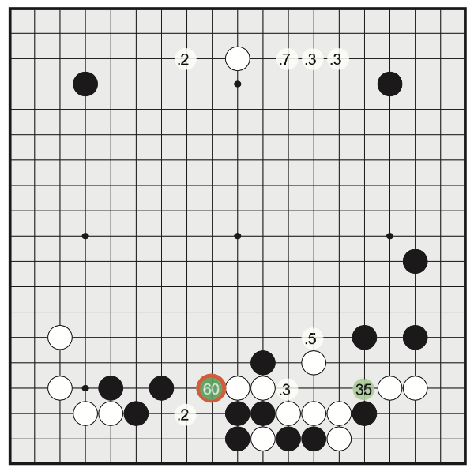
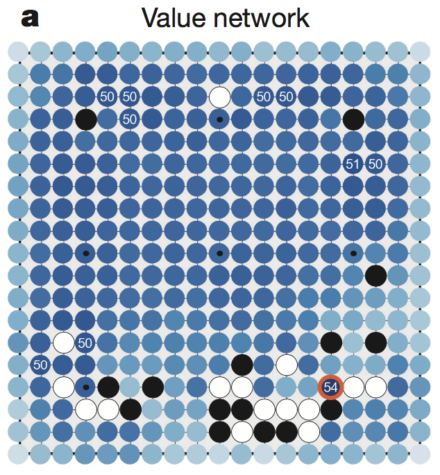
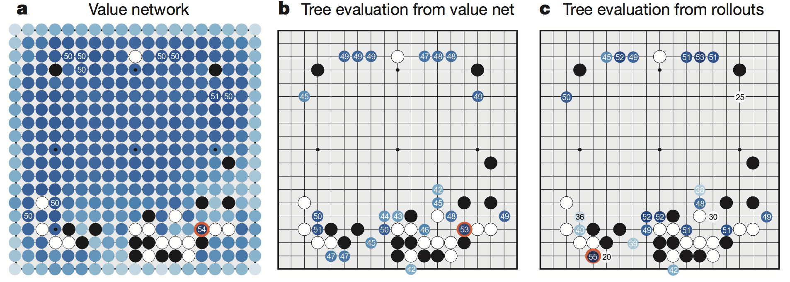
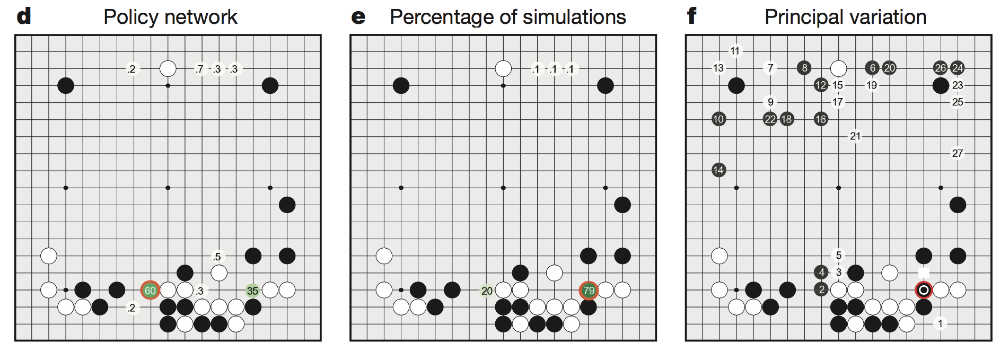
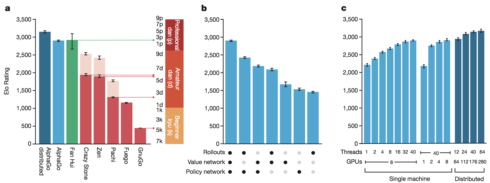

# 问题分析

围棋问题，棋盘 `19 * 19 = 361` 个交叉点可供落子，每个点三种状态，白（用`1`表示），黑（用`-1`表示），无子（用`0`表示），用 $\vec s$ **描述**此时**棋盘的状态**，即棋盘的**状态向量**记为 $ \vec s$ （state首字母）。

<!-- more -->
$$
\vec s = (\underbrace{1,0,-1,\ldots}_{\text{361}})\tag {1-1}
$$
假设状态 $\vec s$ 下，暂不考虑不能落子的情况， 那么下一步可走的位置空间也是361个。将下一步的**落子行动**也用一个361维的向量来表示，记为 $\vec a$ （action首字母）。
$$
\vec a = (0,\ldots,0,1,0,\ldots)\tag {1-2}
$$
公式1.2 假设其中`1`在向量中位置为`39`，则  $\vec a$ 表示在棋盘`(3,1)`位置落**白子**，3为横坐标，1为列坐标

有以上定义，我们就把围棋问题转化为。

>任意给定一个状态  $\vec s$ ，寻找最优的应对策略  $\vec a$ ，最终可以获得棋盘上的最大地盘

> 总之
>
> 看到 $\vec s$ ，脑海中就是**一个棋盘，上面有很多黑白子**
>
> 看到 $\vec a$ ，脑海中就想象一个人**潇洒的落子**

接下来的问题是，如何解决这样一个问题呢？

先上论文！干货第一

[Mastering the game of Go with deep neural networks and tree search](http://ai.arizona.edu/sites/ai/files/resources/mastering_the_game_of_go_with_deep_neural_networks_and_tree_search.pdf)

# 问题解决

首先想到，棋盘也是一幅图像，那么在当时最好用的图像处理算法就是**深度卷积神经网络**（Deep Convolutional Neural Network）。

## 深度卷积神经网络——策略函数（Policy Network）

关于什么是`CNN`，这篇文章十分靠谱，深入浅出的讲解了什么是`CNN`

[An Intuitive Explanation of Convolutional Neural Networks](http://www.kdnuggets.com/2016/11/intuitive-explanation-convolutional-neural-networks.html) （好像[原地址](https://ujjwalkarn.me/2016/08/11/intuitive-explanation-convnets/)挂了）（5.29更新，原地址已经恢复，原地址的排版更好，估计之前那个博主在进行博客的整理）

大致可以理解为：

对一副图像进行处理，给定很多样本进行训练，使得最后的神经网络可以获得指定（**具有分类效果**）的输出。

比如，根据上图可以观察到（这是一个已经训练好的神经网络），最右侧的**输出**是`[0.01 , 0.04 , 0.94 , 0.02]`，其中第三个值`0.94`代表的是boat，接近1，所以我们判断这幅图片中有船这个物体（类似的，如果使用这幅图像进行训练，那么**指定**输出应该是[0, 0, 1, 0]，因为图中只有船这个物体）

- 在Deep Learning中，卷积层的中的**Filter**也需要**训练**，也就是说**我们使用已有数据来学习图像的关键特征，这样，就可以把网络的规模大幅度的降低**

总而言之，**`CNN`可以帮助我们提取出图像中有实际含义的特征**，那么这和围棋又有什么关系呢？我们来看看Deepmind团队是怎么运用`CNN`来解决围棋问题。

### 深度卷积神经网络解决围棋问题

2015年，`Aja Huang`在ICLR的论文[Move Evaluation in Go Using Deep Convolutional Neural Networks](https://arxiv.org/pdf/1412.6564.pdf)中就提出了如何使用`CNN`来解决围棋问题。

他从围棋对战平台KGS上获得了人类选手的围棋对弈棋谱，对于每一个状态 $ \vec s$，都会有一个人类进行 $ \vec a$ 的落子，这也就是一个天然训练样本 $ \langle \vec s,\vec a\rangle $，如此可以得到3000万个训练样本。

之后，将 $ \vec s$ 看做一个`19*19`的二维图像（具体实现依据论文输入数据是`19*19*48`（48是这个位置的其他信息，比如气等信息，激励函数用的 tanh）使用`CNN`进行训练，目标函数就是人类落子向量 ${\vec a}'$，通过使用海量的数据，不断让计算机接近人类落子的位置。就可以得到一个**模拟**人类棋手下棋的神经网络。

使用训练的结果，我们可以得到一个神经网络用来计算对于每一个当前棋盘状态 $ \vec s$ ，所对应的落子向量 $ \vec a$ 的概率分布（之所以是概率分布，是因为，计算好的神经网络，输出一般是一个0-1之间的浮点数，越接近1的点表示在这个位置越接近人类的风格，也可以等同于作为人类概率最大的落点。
$$
\vec a=f(\vec s) \tag{2-1}
$$
根据公式2.1，我们记 $f()$ 为$P_{human}(\vec s)$ ，论文中也叫做`Policy Network`，也称策略函数。表示的含义是

> 在状态 $\vec s$ 下，进行哪一个落子 $\vec a$ 是**最接近人类风格的**

计算出来的直观结果，对应到棋盘上如下图，可以看到，红色的区域的值有60%，次大值位于右方，是35%（此图来自于AlphaGo论文）

还记得刚刚举得船图的例子嘛？可以类比一下，机器发现现在的状态 $ \vec s$ 和之前的某一种类型有些类似，输出是一个`1*361`的向量，其中有几个值比较大（接近1就是100%），那么就用这个值当做下一个 $ \vec a$ 的位置。不幸的，这种训练方法有很大的局限的，可以直观想到的是，如果对战平台上数据本身就都是`俗手`，那不是训练出来一个很蠢的神经网络嘛？棋力如何呢？

### 深度卷积网络策略的棋力

很不幸，据`Aja Huang`本人说，这个网络的棋力大概相当于业余6段所有的的人类选手。远远未能超过当时最强的围棋电脑程序`CrazyStone`。

既然比不过，那么就学习它，`Aja Huang`打算把 $P_{human}(\vec s)$ 和`CrazyStone`结合一下，那么问题就来了，	`CrazyStone`是怎么来解决围棋问题的呢？

这是`Aja Huang`的老师`Remi Colulum`在2006年对围棋AI做出的另一大重要突破

**干货论文送上** MCTS

[Efficient Selectivity and Backup Operators in Monte-Carlo Tree Search](https://github.com/papers-we-love/papers-we-love/blob/5a54fa883a813e81b1e54bfed9669fc8961dedb4/artificial_intelligence/efficient-selectivity-and-backup-operators-in-monte-carlo-tree-search.pdf)

## MCTS 蒙特卡洛搜索树——走子演算（Rollout）

蒙特卡洛搜索树（Monte-Carlo Tree Search）是一种*大智若愚*的方法，它的基本思想是：

首先模拟一盘对决，使用的思路很简单，**随机**

- 面对一个空白棋盘 $\vec s_0$，最初我们对棋盘一无所知，假设所有落子的方法**分值**都相等，设为`1`
- 之后，**【随机】**从`361`种方法中选一种走法 $\vec a_0$，在这一步后，棋盘状态变为 $\vec s\_1$。之后假设对方也和自己一样，**【随机】**走了一步，此时棋盘状态变为 $\vec s\_2$
- 重复以上步骤直到 $\vec s\_n$并且双方分出胜负，此时便完整的模拟完了一盘棋，我们假设一个变量`r`，胜利记为1，失败则为0

那么问题就来了，如果这一盘赢了，那意味着这一连串的下法至少比对面那个二逼要明智一些，毕竟我最后赢了，那么我把这次落子方法 $(\vec s\_0, \vec a\_0)$ 记下来，并把它的分值变化：
$$
\text{新分数} = \text{初始分数} + r \tag{2-2}
$$
同理，可以把之后所有随机出来的落子方法 $(\vec s\_i, \vec a\_i)$ 都应用2-2公式，即都加`1`分。之后开始第二次模拟，这一次，我们对棋盘不是一无所知了，至少在  $\vec s\_0$ 状态我们知道落子方法  $\vec a\_0$ 的分值是2，其他都是1，我们使用这个数据的方法是：在这次**随机**中，**我们随机到  $\vec a\_0$ 状态的概率要比其他方法高一点**。

之后，我们不断重复以上步骤，这样，那些看起来不错（以最后的胜负来作为判断依据）的落子方案的分数就会越来越高，并且这些落子方案也是比较有前途的，会被更多的选择。


$$
score(\vec s) = \begin{pmatrix}
r_{11} & r_{12}  & \cdots & r_{1n} \\
r_{21} & r_{22}  & \cdots & r_{2n} \\
\vdots  & \vdots & \ddots & \vdots \\
r_{n1} & r_{n2}  & \cdots & r_{nn} 
\end{pmatrix}
$$


> 如上述公式所述，`n=19`，每一个状态 $\vec s$ 都有一个对应的每个落子点的分数，只要模拟量足够多，那么可以覆盖到的 $\vec s$ 状态就越多，漏洞就越来越小（可以思考李世石的神之一手，是否触及到了AlphaGo1.0的软肋呢？即没有考虑到的状态 $\vec s$ ）

最后，当进行了10万盘棋后，在此状态选择那个**分数最高**的方案落子，此时，才真正下了**这步棋**。这种过程在论文里被称为**Rollout**

蒙特卡洛搜索树的方法十分的深刻精巧，充满的创造力，它有一些很有意思的特点：

- 没有任何人工决策的`if else`逻辑，完全依照规则本身，通过不断的想象（随机）来进行自我对弈，最后提升这一步的质量。有意思的是，其实这也是遵照了人类下棋的思维模式（**模仿**，只是这一次模仿的不是下棋风格，而是人类思考的方式。十分奇妙，人从飞鸟中受到启发发明了飞机，从鱼身上受到启发发明了潜艇，现在，机器学习的程序，通过学习人类使自身发生进化），人类中，水平越高的棋手，算的棋越多，只是人类对于每一个落子的判断能力更加强大，思考中的棋路，也比**随机**方式有效的多，但是机器胜在量大，暴力的覆盖到了很多情况。*注意，这一个特点也为之后的提高提供了思路*。
- MCTS可是持续运行。这种算法在对手思考对策的时候自己也可以思考对策。在对方思考落子的过程中，MCTS也可以继续进行演算，在对面落子后，在用现在棋盘的情况进行演算，并且之前计算的结果一定可以用在现在情况中，因为对手的下的这步棋，很可能也在之前演算的高分落子选择内。这一点十分像人类
- MCTS是**完全可并行**的算法

`Aja Huang`很快意识到这种方法的缺陷在哪里：初始策略（或者说**随机的落子方式**）太过简单。就如同上面第一条特点所说，人类对每种  $\vec s$ （棋型）都要更强的判断能力，那么我们是否可以用 $P\_{human}(\vec s)$ 来代替随机呢？

`Aja Huang`改进了MCTS，每一步不使用随机，而是现根据 $P\_{human}(\vec s)​$ 计算得到  $\vec a​$ 可能的概率分布，以这儿概率为准来挑选下一个  $\vec a​$。一次棋局下完之后，新分数按照下面的方式来更新
$$
\text{新分数} = \text{调整后的初始分} + \text{通过模拟的赢棋概率} \tag{2-3}
$$
如果某一步被随机到很多次，就应该主要依据模拟得到的概率而非 $P\_{human}(\vec s)$ ，就是说当盘数不断的增加，模拟得到的结果可能会好于 $P\_{human}(\vec s)$ 得到的结果。

所以 $P\_{human}(\vec s)$ 的初始分会被打个折扣，这也是公式2-3中的调整后的初始分的由来
 
$$
\text{调整后的初始分} = \frac{P_{human}(\vec s)}{(\text{被随机到的次数} + 1)} \tag{2-4}
$$

如此一来，就在整张地图上利用 $P\_{human}(\vec s)$ 快速定位了比较好的落子方案，也增加了其他位置的概率。实际操作中发现，此方案不可行，因为计算这个 $P\_{human}(\vec s)$ **太慢了太慢了**

一次 $P\_{human}(\vec s)$ 的计算需要`3ms`，随机算法`1us`，慢了3000倍，所以，`Aja huang`训练了一个简化版本的 $P\_{human-fast}(\vec s)$ ，把神经网络层数、输入特征减少，耗时下降到`2us`，基本满足了要求。

更多的，策略是，先以 $P\_{human}(\vec s)$ 开局，走前面大概20步，之后再使用 $P\_{human-fast}(\vec s)$ 走完剩下的到最后。兼顾速度和准确性。

综合了深度卷积神经网络和MCTS两种方案，此时的围棋程序已经可以战胜所有其他电脑，虽然和其他人类职业选手还有一定的差距。

2015年2月，`Aja Huang`在Deepmind的同事在顶级学术期刊nature上发表的文章 [Human-level control through deep reinforcement learning](http://gnusha.org/~nmz787/pdf/Human-level_control_through_deep_reinforcement_learning.pdf) 用神经网络打游戏。这篇文章，给AlphaGo提供的了新的方向

## 强化学习——局面函数（Value Network）

强化学习（Reinforcement learning）用来实现**左右互搏和自我进化**，首先说说这篇论文干了一件什么事情，Deepmind团队的大牛们使用强化学习的方法在红白机上打通了200多个游戏，大多数得分都要比人好。

### 什么是强化学习

那什么是强化学习呢？这里推荐莫烦大神的 [什么是强化学习](https://zhuanlan.zhihu.com/p/24807239) 系列教程的知乎专栏，以及另一篇[强化学习指南](http://geniferology.blogspot.hk/2015/04/what-is-reinforcement-learning.html) 后者对强化学习的基本概念，实现方法进行全面的讲解，含有公式推导。还有两篇我自己做的笔记，[什么是强化学习](https://mubu.com/doc/WNKomuDNl)，[强化学习算法介绍](https://mubu.com/doc/2xNipOEK3l)

对于强化学习（Reinforcement learning），它是机器学习的一个分支，特别善於控制一只能够在某个环境下**自主行动**的个体 (autonomous **agent**)，透过和**环境**之间的互动，例如 sensory perception 和 rewards，而不断改进它的 **行为**。

比如，吃豆人游戏，自主行动的个体就是控制的吃豆人，环境就是迷宫，奖励就是吃到的豆子，行为就是上下左右的操作。

强化学习的输入是

- **状态** (<u>S</u>tates) = 环境，例如迷宫的每一格是一个 state
- **动作** (<u>A</u>ctions) = 在每个状态下，有什么行动是容许的
- **奖励** (<u>R</u>ewards) = 进入每个状态时，能带来正面或负面的 **价值** (utility)

输出是

- **方案** (<u>P</u>olicy) = 在每个状态下，你会选择哪个行动？也是一个函数

所以，我们需要根据S，A，R，来确定什么样的P是比较好的，通过不断的进行游戏，获得大量的交互数据，我们可以确定在每一个状态下，进行什么动作能获得最好的分数，而强化学习也就是利用神经网络来拟合这个过程。

例如，打砖块游戏有一个**秘诀**是把求打到墙后，这样球能自己反弹得分，强化学习程序在玩了600盘后，学到了这个秘诀。也就是说程序会在每一个状态下选择那个更容易把球打到墙后面去的操作。如下图，球快要把墙打穿的时候，评价函数 $v$ 的值会大幅度上升

我们可以发现，强化学习的基本思路和MCTS后异曲同工之妙，也是在对游戏完全没有了解的情况，通过不断的训练（进行多盘对弈，和获得进行行动后的分数反馈）来进行训练，自我提升。

### 利用强化学习增强棋力

参考这种思路，`Aja Huang`给围棋也设计了一个评价函数 $v(\vec s)$ 。此函数的功能是：**量化评估围棋局面**。使用$v(\vec s)$可以让我们在MCTS的过程中**不用走完全局**（走完全盘耗时耗力，效率不高）就发现**已经必败**。

在利用 $P\_{human}(\vec s)$ 走了开局的20步后，**如果有一个 $v(\vec s_i)$ （i为当前状态）可以直接判断是否能赢，得到最后的结果`r`**，不需要搜索到底，可以从效率（剪枝，优化算法时间复杂度）上进一步增加MCTS的威力。

很可惜的，现有的人类棋谱不足以得出这个评价函数。所以`Aja Huang`决定用**机器和机器对弈**的方法来创造新的对局，也就是AlphaGo的左右互搏。

### 自对弈

- 先用 $P\_{human}(\vec s)$ 和 $P\_{human}(\vec s)$ 对弈，比如1万盘，得到1万个新棋谱，加入到训练集中，训练出 $P_{human-1}(\vec s)$ 。
- 使用$P\_{human-1}(\vec s)$和$P\_{human-1}(\vec s)$对弈，得到另1万个新棋谱，加入训练集，训练出$P\_{human-2}(\vec s)$。
- 同理，进行多次的类似训练，训练出$P\_{human-n}(\vec s)$，给最后的新策略命名为$P\_{human-plus}(\vec s)$

（感觉一下，这个$P\_{human-plus}(\vec s)$ 应该挺强力的！这里回顾一下$P\_{human}(\vec s)$是什么：是一个函数，$\vec a=f(\vec s)$ 可以计算出当前 $\vec s$ 下的落子 $\vec a$ 的分布概率）

使用$P\_{human-plus}(\vec s)$和$P\_{human}(\vec s)$进行对弈，发现$P\_{human-plus}(\vec s)$胜率80%，自对弈的方法被证明是有效的。（这里有一个想法，我在之前，一直加粗随机，之所以自对弈有效，就是因为整过MCTS过程中从来没有放弃过**随机**，如此一来，大量的计算，就更可能覆盖到更多的可能性，对提高棋力可以产生有效的作用同时。因为概率的问题，不断的自我对弈肯定造成下棋的路数集中，后面也会有体现）

但是事实并没有那么美好，`Aja Huang`发现，使用$P\_{human-plus}(\vec s)$来代替$P\_{human}(\vec s)$进行MCTS反而**棋力会下降**。

`Aja Huang`认为是$P\_{human-plus}(\vec s)$走棋的路数太集中，而MCTS需要更加发散的选择才能有更好的效果。

### 计算局部评价函数（Value Network）

考虑到$P\_{human-plus}(\vec s)$的下法太过集中，`Aja Huang`计算 $v(\vec s)$ 的策略是：

- 开局先用$P\_{human}(\vec s)$走`L`步，有利于生成更多局面
- 即使如此，`Aja Huang`还是觉得局面不够多样，为了进一步扩大搜索空间，在`L+1`步时，完全随机一个 $\vec a$ 落子，记下这个状态 $v(\vec s_{L+1})$ 
- 之后使用$P\_{human-plus}(\vec s)$来进行对弈，直到结束时获得结果`r`，如此不断对弈，由于`L`也是一个随机数，我们可以得到，**开局、中盘、官子**等不同阶段的很多局面 $\vec s$，和这些局面对应的结果`r`
- 有了这些训练样本 $\langle \vec s,r\rangle$，还是使用**神经网络**，把最后一层改成**回归**而非**分类**（这里不是用的分类，而是用的**回归，拟合**），就得到了一个 $v(\vec s)$ 来输出**赢棋的概率**

  

如上图所示，$v(\vec s)$ 可以给出下一步落在棋盘上任意位置后，如果双方都用$P\_{human-plus}(\vec s)$来走棋，我方赢棋的概率。实验表明，仅仅使用$P\_{human}(\vec s)$来训练 $v(\vec s)$ 效果不如$P\_{human-plus}(\vec s)$，强化学习是确实有效的。

总结，**强化学习的$P\_{human-plus}(\vec s)$主要是用来获得 $v(\vec s)$ 局部评估函数**。表示的含义是

> 在状态 $\vec s$ 下，**局面的优劣程度，或者说此时的胜率是多少**
>
>  **$v(\vec s)$ 局部评估函数拥有在线下不断自我进化的能力（这也是AlphaGo可以随时间越来越强的最重要的部分）**

感谢你看到这里，我们已经拥有：

- $P\_{human}(\vec s)$ `我的老师是人类！`
- MCTS `乱下，我只看输赢`
- $v(\vec s)$ `我能判断局势`

有了这些我们距离AlphaGo已经不远了

## AlphaGo

`Aja Huang`使用MCTS框架融合局面评估函数 $v(\vec s)$ 的策略是：

- 使用$P\_{human}(\vec s)$作为初始分开局，每局选择分数最高的方案落子
- 到第`L`步后，改用$P\_{human-fast}(\vec s)$把剩下的棋局走完，同时调用 $v(\vec s_L)$，评估局面的获胜概率，按照如下规则更新整个树的分数
  ​
$$
\text{新分数} = \text{调整后的初始分} + 0.5\*\text{通过模拟得到的赢棋概率} + 0.5\*\text{局面评估分} \tag {3-1}
$$

- 前两项和原来一样
  - 如果待更新的节点就是叶子节点，局面评估分就是 $v(\vec s\_L)$ 
  - 如果是待更新的节点是上级节点，局面评估分是该叶子节点 $v(\vec s)$ 的平均值

如果 $v(\vec s)$ 是表示大局观，$P\_{human-fast}(\vec s)$表示快速演算，那么上面的方法就是二者的并重，并且`Aja Huang`团队已经用实验证明0.5 0.5的权重对阵其他权重有95%的胜率

### 详解AlphaGo VS 樊麾 对局走下某一步的计算过程

`a图`使用局部评估函数计算出 $\vec s$ 状态下**其他落子点的胜率**

`b图`MCTS中使用**局部评估函数**加 $P\_{human}(\vec s)$ 得出的结果

`c图`MCTS中使用$P\_{human}(\vec s)$（复合算法）和$P\_{human-fast}(\vec s)$走子走到底的结果

`d图`深度卷积神经网络使用**策略函数**计算出来的结果

`e图`使用[公式3-1](#3-1)和相关流程计算出的落子概率

`f图`演示了AlphaGo和樊麾对弈的计算过程，AlphaGo执黑，樊麾执白。红圈是AlphaGo实际落子额地方。1，2，3和后面的数字表示他想象中的之后樊麾下一步落子的地方。**白色方框**是樊麾的实际落子。在复盘时，樊麾认为1的走法更好（这说明在樊麾落子后AlphaGo也在进行计算）

# 总结

由于**状态数有限**和**不存在随机性**，象棋和五子棋这类游戏理论上可以由终局自底向上的推算出每一个局面的胜负情况，从而得到最优策略。例如五子棋就被验证为**先手必胜**。

AlphaGo的MCTS属于**启发式搜索算法**

> 启发式搜索算法：由当前局面开始，尝试看起来<u>可靠的行动</u>，达到终局或一定步数后停止，根据后续<u>局面的优劣</u>反馈，选择最有行动。通俗来说，就是”手下一招子，心想三步棋“

围棋是一个NP问题，要穷举的话，解空间巨大。现代优化算法的经典之处在于，从围棋的规则来看，在某一个状态，必定有一个或几个较优解，整个AlphaGo就是想方设法的去找这个较优解。**利用局面评估函数来对MCTS进行剪枝的思路十分精彩**。利用上面的3个算法，结合庞大的并行运算能力，还有`Aja Huang`团队的辛苦付出，造就了AlphaGo的奇迹。

## 使用不同组件AlphGo1.0的棋力

上图显示了各种算法的棋力，Rollout是走棋演算，也就是`MCTS`，Value Network是 $v(\vec s)$ 局面评估函数，Policy Network 是结合$P\_{human-plus}(\vec s)$和$P\_{human}(\vec s)$后计算的策略函数（下一步走在哪里胜率高的深度卷积神经网络）

整个AlphaGo使用的技术，深度卷积网络，强化学习神经网络，都是炙手可热的领域，近年来发展迅猛，日新月异。AlphaGo已经完成了自己历史使命，**借助棋类的巅峰【围棋】为叩门砖打开了机器学习自我进化的大门**

## 李世石 VS AlphaGo 1.0——第四局78手挖

赛后AlphaGo之父给出的关键信息：`李世石78手“挖”是AlphaGo认为概率极小的点`，这一手之后导致的状态 $\vec s$ 进入到了AlphaGo能处理的范围之外，即之前AlphaGo的**自对弈**都是建立用自己觉得好的下法来搜索的，那么如果这一手AlphaGo1.0感觉可能性极小，那么用$P\_{human}(\vec s)$自对弈的棋谱中就更加难以覆盖。

但是也需要提到的是，根据比赛中柯洁等人的观战我们知道，如果不是后面AlphaGo进入了混乱模式，78手不一定是一个好棋。只能说这一手，顶到了AlphaGo的软肋，在真正和人的对局中不一定是“神之一手”

根据Deepmind团队给出的数据可以知道，一年前，AphaGo1.0的搜索空间，自对弈深度并不完美。所以Deepmind团队有意的在**代码逻辑**上让其**避免打劫**，或者说避免**劫争**，例如，有两个选择，一个胜率60%但需要打劫，另一个55%但不需要打劫，AlphaGo1.0会选择后者。

那么什么是打劫呢？解释这几个和”劫“有关的围棋术语是：

`打劫`围棋术语，一方制造事端，和另一方讨价还价的行为。
`劫材`可以用来做价格谈判的筹码。通常是走一手没戏，但对手若不予置理，再走第二手会出棋的局部。
`寻劫`通过目数计算，寻找一些有价值的局部制造事端强迫对手应答。通常价值至少需要和打劫的地方相当或者小不太多，否则对方很容易消劫。
`利用劫`劫胜可杀死对方或者得到利益，劫败也应该让对方付出代价，除非双方劫材大小和数量相差悬殊。

通俗的说是，我在这一片已经处于劣势，我换一个战场，发动进攻，你应不应？可能在另外战场的角力中对这边战场的局势产生影响。可以类比于，五子棋中的冲四。

如果有人观看了这一盘棋，我们也可以听到柯洁在强调，AlphaGo在避免打劫，出现了几手莫名其妙的落子。

**总结来说，AlphaGo依靠的是对局外的大量计算，无论是局部评估函数，还是$P_{human-plus}(\vec s)$都十分依赖对局外的大量的计算。**随着时间的推移，AlphaGo在对局过程需要的时间越来越固定，不需要在对局时进行太多的MCTS搜索就能获得AlphaGo的下一手位置，可以预见，MCTS的搜索深度不会太深。当计算量十分庞大的时候，依赖更多是那个120层的Policy Network。

从柯洁的第二盘可以发现，他已经努力的制造在中腹引入多方战斗的带劫争的复杂棋局，十分精彩。可惜，AlphaGo2.0貌似已经完善了自己的阿特留斯之踵。当真无敌，说到这里，我们来谈谈AlphaGo2.0

## AlphaGo 2.0 VS 柯洁——虽败犹荣

三盘对局，感觉到AlphaGo在这一年内进行了极为深度的训练。最可怕的是AlphaGo通过时间**验证了机器学习对于解决NP问题的强大潜力**（通过这三盘可以看出已经无限接近解决了这个问题，至少在对人类上）。甚至：

- 臆想一，是否可以利用AlphaGo来**判断规则是否公平**（中国和韩日规则的不同，7目半和6目半）。
- 臆想二，最终AlphaGo的自对弈是接近和棋。可惜AlphaGo已经退役。希望针对Deepmind放出的50盘自对弈棋谱可以研究出一些门道，使得围棋这门竞技本身有更大的突破。

**局面函数**和**策略函数**愈发强大，愈加的接近于”围棋之神“。

随着Google TPU的发布，跑在`TPU阵列`上的AlphaGo如虎添翼，MCTS的走子演算效率更高，速度更快（加速的其实就是$P_{human-plus}(\vec s)$的落子速度。

关于TPU的设计思路和原理可以参考 [In-Datacenter Performance Analysis of a Tensor Processor](https://arxiv.org/pdf/1704.04760.pdf)

对于围棋这个策略单步游戏，是存在**N步最优解**（不存在`i+1`步最优解），AlphaGo已经在正确的道路上无限的接近于这个**N步最优解**，仿佛在某一步已经看到了你无论怎么下都能走到的N步最优解。

人类的每一次失误都会使局部评估函数往胜率移动一点，这一点是十分可怕的，因为算法本身的优越性，**大局观**对于AlphaGo的逻辑来说本身就是一种刻在骨子里的基因

- 一是因为AlphaGo每次MCTS计算都会计算到接近分出胜负，具有**前瞻性**
- 二是因为局面函数本身就是为了来统计大局形势定义的，具有**判断局面优劣**的能力

所谓大局观，不就是这种**走一步看N步的能力**嘛。

## 对未来的展望——从AlphaGo想开去

珍贵的并不是攻克了围棋问题本身，**而是这种解决问题的基本模式**，可以推而广之到很多领域。

先通过卷积网络学习人类的下法，算出策略函数（Policy Network），再通过**模仿**进行强化学习，左右互搏，不断自我进化，再加上MCTS的经典的解决问题的启发式搜索算法。

> 这俨然是一个 **模仿➜学习➜优化**的过程

或许，模仿人类，是机器学习最终的归途，至于应用领域方面

游戏AI是一个最容易想到的领域，只要能抽象出 `State` `Action` `Judgement`，那么这一套解决问题的方式就可以举一反三，让每一个1V1领域的游戏AI非常强大（OpenAI在Dota2 1V1 Solo上的结果更加证明了这一点），至于合作领域的AI可能需要更大的计算量去计算（OpenAI发布的论文[MultiAgent](https://blog.openai.com/learning-to-cooperate-compete-and-communicate/)很有启发性），对于实际问题来说获得这样的AI有多大的经济价值值得推敲。

游戏的乐趣就在于**不确定性**，适当的失误也是竞技类游戏的魅力所在，一个能看到**N步最优解**的AI会让一个游戏机制，游戏规则变得可数据化，这一点其实是游戏被创造出来的初衷相背离的。

其他方面，只要是人类可以学习出来的事物，比如翻译，编程，都是现在的这套体系可能解决的问题，我们期待未来这套**解决问题的方法发挥出无穷的力量**吧！

[Reference] 
知乎[Tao Lei大神的回答](https://www.zhihu.com/question/41176911)
知乎[袁行远大神的回答](https://www.zhihu.com/question/41176911)
知乎[有关围棋打劫的回答](https://www.zhihu.com/question/28655005/answer/61142081)
其他文章中引用的论文，链接已经给出