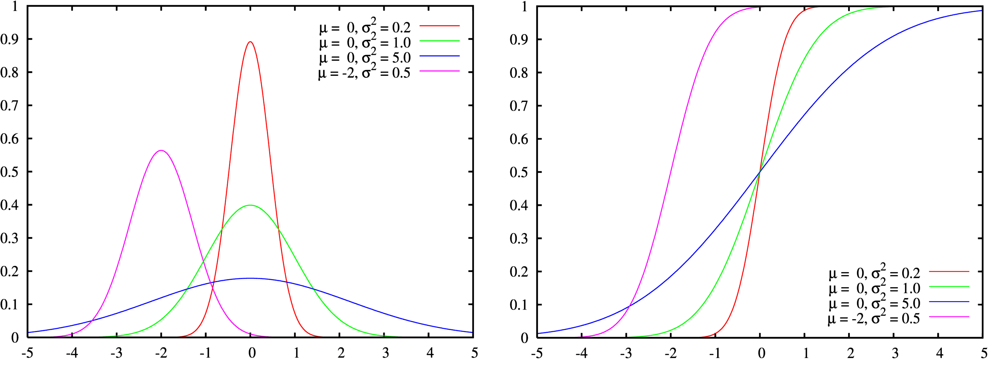
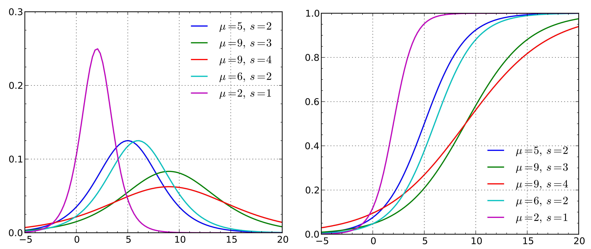
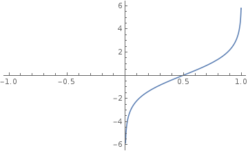

【阅读时间】17min - 22min
【内容简介】从不同角度解释**为何使用Logistic回归模型**，解读模型的**现实意义**，详细解读**为何使用**以及**什么是**交叉熵损失函数。并详细梳理符号表达，对公式不再恐惧

<!-- more -->

## 什么是【回归（Regression）】

回归（Regression）是一项模拟技术，用来从**一个或多个解释变量**中<u>预测</u>**输出变量的值**

## 什么是及为什么【Logistic Regression】

回归（Regression）是用来预测的，比如给你一组虫子的腿长和翅膀长数据，让你判断虫子是A类虫还是B类虫。

**逻辑回归**则是用来预测**二进制**输出变量取值（如：**是/不是**）的预测技术

> 即输出变量只有**两个值**得预测技术

下文中将会从不同的角度

### 概率论角度

首先，需要回忆一下几个概念

【大数定理】


$$
\lim_{n\to\infty} \frac{1}{n} \sum_{i=1}^n {X_i} = \mu
$$


不断的采样一个随机变量，得到n个值，当n趋向于**正无穷**的时候，这个**平均值**就收敛于随机变量的**期望**

【中心极限定理】

大量**相互独立{条件1**}的随机变量，其均值的分布以**正态分布{结论}**为**极限{条件2}**

【贝叶斯公式】

默认你已经对**条件概率**了若指掌（在某件事情已经发生的情况下另一件事发生的概率），关于[贝叶斯方法的前世今生](https://mubu.com/doc/2pJ0IojsIl)，这个链接或许可以帮到你。

那贝叶斯公式是如何推出来的？

#### 问题描述

我们需要求的问题是：你在校园里面随机游走，遇到了**N个穿长裤的人**（但是可能因为你高度近视你无法看出他们的性别），**问，这N个人里面有多少个女生，多少个男生**，即，穿裤子的人里面有多少个女生

#### 解决过程


$$
穿裤子的人中的女生比例 = \frac{穿长裤的女生人数}{穿长裤的总人数} =\\  \frac {U\times P(Girl)\times P(Paints|Girl)}{U\times P(Boy)\times P(Paints|Boy) + U\times P(Girl)\times P(Paints|Girl)}\tag{1-1}
$$
化简上式，可以发现其实分母合起来就是 $P(Paints)$ ，分子其实就是既穿裤子又是女孩，整理得
$$
P(Girl|Paints) = \frac{P(Girl) \times P(Paints|Girl)}{P(Paints)}
$$
 

再一般化，用A表示穿裤子的，B表示女生
$$
P(B|A) = \frac{P(B)\times P(A|B)}{P(A)} = \frac{P(AB)}{P(A)}\tag{1-2}
$$
上式就是贝叶斯公式的一般形式，我们在推导中发现，**正常人类对频率的感知和理解速度要高于对概率的**。

比如“穿长裤的女生人数”这个概念，用总人数乘以**女人比例**，得出**女生人数**，再用女生人数乘以**女生中穿裤子人数的比例**得到**穿裤子的女生人数**。这一串推导感觉毫无困难。但如果读成：在A发生条件下，发成B的概率，会让人乍看下，感到有一定的理解困难。

我们常说Sense，我觉得这就是一种敏感，对条件概率表达方式的敏感，在你看到的时候，抓住那个最关键的点，不存在任何的迷惑

那Logistic Function和贝叶斯公式有什么联系呢？

如果我们把公式（1-1）也符号化，$B\_1$ 表示女生，$B\_2$表示男生，$A$ 表示穿裤子
$$
P(B_1|A) = \frac {P(B_1)P(A|B_1)}{P(B_2)P(A|B_2) + P(B_1)P(A|B_1)}\tag{1-3}
$$
右边同时除以 $P(B\_1)\times P(A|B\_1)$ ，并定义 $a = \ln{\left( \frac{P(B\_1)P(A|B\_1)}{P(B\_2)P(A|B\_2)}\right)}$ 直接由公式(1-3)可得到
$$
f(a) = \frac{1}{1 + e^{-a}} \tag{1-4}
$$
很熟悉的形式，其实就是`logistic函数`的一般形式（对数几率函数），而这个函数的值就是 $f(a)$ ，很明显，**是一个概率**

**另一个很重要超级重要的常识就是：正态分布的的累计分布函数（就是从负无穷到x积分）和概率分布函数长得样子很像Logistic累计分布函数和概率密度函数**，可能看到这句话很多人就已经真相大白了，应给无论从中心极限定理出发，还是从统计学概率论角度来看，**概率分布存在的价值是为了描述自然界（现实）中的随机事件，构造函数本身就十分重要，不同的规律需要不同的函数去拟合**

### 统计学角度

#### 动机 - 需要解决什么问题

在现实生活中，有时候需要探究**某一事件 $A$ 发生的概率 $P$ （0 - 1 之间的一个数）与某些因素 $\mathbf X = (X_1, X_2, \ldots, X_p)'$ 之间的关系**。（其中1到p是各种不同的因素）

☆ 【**核心问题**】考虑到很多情况下，$P$ 对 $\mathbf X$ 的变化并不敏感，即 $\mathbf X$ 需要发生**很大的变化**才能引起 $P$  的**微弱改变**

> 比如，<u>农药的用量</u>和<u>杀死害虫的概率</u>之间，在农药用量在很小的范围内增长的时候，因为药效不够，杀死害虫的概率增长很慢。

因此，我们要构造一个关于 $P$ 的函数 $\theta(P)$ ，使得它在 $P = 0$ 或 $P = 1$ 附近，$P$ 的微小变化对应 $\theta(P)$ 的较大改变，同时，$\theta(P)$ 要尽可能的简单。于是，我们可以**构造一个函数**（注意：构造函数是数学中很有效的手段，我们需要什么特性就用什么方法来构造一个满足我们需求的函数）c
$$
\frac {\partial \theta(P)}{\partial P} =\frac{1}{P} +\frac{1}{1-P}
$$
根据上述公式可以**解得**
$$
\theta(P) =\ln\left(\frac{P}{1-P}\right)
$$

这个 $\theta(P)​$ 就是`Logit变换`，可以看到，这个函数很符合我们的要求： $P = 0​$ 或 $P = 1​$ 附近，$P​$ 的微小变化对应 $\theta(P)​$ 的较大改变

#### 方案 - 如何解决这个问题

为了建立因变量 $P$ 与自变量 $\mathbf X$ 之间的**合理变动关系**，一个很自然的假设就是**线性关系**，也就是：
$$
P = \mathbf X'  \boldsymbol{\beta}
$$
其中 $\boldsymbol \beta = (\beta_1,\beta_1,\ldots,\beta_p)$ 表示每一个不同因素对最终概率 $P$ 产生的影响（这个也可以写作，权重weight）

由需求可知，在某些情况下，$P = 0$ 或 $P = 1$ 附近，$P$ 对 $\mathbf X$ 的变化并不敏感，简单的线性关系**不能反映这一特征**。此时，构造的  $\theta(P)$ 就派上用场了
$$
\ln\left(\frac{P}{1-P}\right) = \mathbf X'  \boldsymbol{\beta}
$$
进行一系列的公式推导有
$$
\ln\left(\frac{P}{1-P}\right) = \mathbf X^\mathrm T \boldsymbol{\beta} \implies \frac{P}{1-P} = e^{\mathbf X^\mathrm T \boldsymbol{\beta}} \implies P = \frac{e^{\mathbf X^\mathrm T \boldsymbol{\beta}}}{1 + e^{\mathbf X^\mathrm T \boldsymbol{\beta}}}
$$
则上述最后推出的就是`Logistic回归模型`
### 机器学习角度

周志华《机器学习》，3.3 对数几率回归笔记

和统计学角度相同，我们的目的是依旧是完成一个**二分类任务**，输出标记 $y \in \{0,1\}$ ，而线性回归模型产生的预测值 $z = \boldsymbol w^{T}\boldsymbol x + b$ 是实值，于是，我们需要把 z 转换为0/1值，最理想的是`单位阶跃函数`（unit-step function z > 0➜y=1，z<0➜y=1）

单单位阶跃函数**不连续**，不能微分，积分，求逆，于是我们希望找到能在一定程度上近似单位阶跃函数的`替代函数（surrogate function）`，并希望它单调可微，答案很明显，就是`对数几率函数（logistic function）`
$$
y = \frac{1}{1+e^{-z}}
$$

z 为预测值，y 为输出，`对数几率函数`是一种`Sigmoid函数`【一种形状类似S的函数】，将$z = \boldsymbol w^{T}\boldsymbol x + b$ 带入上面的公式

$$
y = \frac{1}{1+e^{-(\boldsymbol w^{T}\boldsymbol x + b)}} \implies \ln(\frac{y}{1-y}) = \boldsymbol w^{T}\boldsymbol x + b
$$
如果将 $y$ 作为 $\mathbf x$ 作为正例的可能性，$1-y$ 为其反例的可能性
$$
\frac {y}{1-y}
$$
上面的式子成为“几率”(odds)：表示 $\mathbf x$ 是正例的**相对可能性**，对odds取对数得到“几率对数”(log odds，也就做logit)

### 生态学角度

可以换一个角度来解读这个问题的前世今生

1798年的时候一个叫Malthus的英国牧师发现**人口的变化率**和**人口的数目**成正比，需要用数学的手法建立一个公式来表征这个现象，则，使用 $N(t)$ 这个函数来表示`t`时刻某个地区的**总人口数**（根据**成正比**）
$$
\frac{dN(t)}{dt} = {rN(t)}
$$

> 其中，`r`是常数，表示 $N(t)$ 的变化率

直接解出这个方程
$$
N(t) = N_0e^{rt}
$$
这很明显是一个指数增长函数，其实也是种群增长的函数表示

但是问题也是很明显的：种群因为**环境容量**的限制一定是**不能无限增长的**，即，这个模型非常不靠谱，需要重新设计模型来复合现实中的情况。Pierre-François Verhulst 在1838年提出，**构造一个函数**
$$
\frac{dN(t)}{dt} = {rN(t)}\left(1 - \frac{N(t)}{K}\right)
$$

> K是一个常数，表示系统的容量（capacity）

令 $f(t) = \frac{N(t)}{K}$ ，在方程两边同时除以 $K$ ，上述方程变为：
$$
\frac{df(t)}{dt} = rf(1 - f)
$$
这也是`Logistic方程`的一般形式

### 总结

从不同的角度来研究问题就会发现，其实很多时候我们解决一个问题具有一个**相似的模式**，包括**大数定律**，**贝叶斯全概率公式**是一切的基石和解决问题的主要工具

一个模型的建立规则依据**数据的分布特征**，而这里依托的一个关键信息就是：**在靠近输入0，1两点的时候，y随x的变化不明显**，线性模型没法很好的反应这个特征，所以就构造了一个逻辑回归模型来表示这个特征

并且`Logistic回归模型`的**本质**是一个**概率模型**，因为在描述该分类时，我们其实是以概率来衡量的

## 重要概念

### 均方误差 Mean Squre Error MSE

指参数估计值与参数真值之差平方的**期望值**，是一种目标函数（Objective Function），常用于线性回归
$$
MSE = \frac{1}{n} \sum_{t = 1}^n{(observed_t - predicted_t)}^2
$$

### 交叉熵 Cross Entropy

又称为logloss，是Objective function的一种，也称Loss function or Coss Function

#### 什么是熵

我觉得这个问题必须搞明白一件事就是：什么是`熵 Entropy`

- 广义的定义是：熵是描述一个系统的**无序程度**的变量；同样的表述还有，熵是系统混乱度的度量，一切自发的不可逆过程都是从**有序**到**无序**的变化过程，向熵增的方向进行
- 有一个很神奇的解释是：熵字为火字旁加商。当时有位姓胡的学者作为普朗克的防疫。S(entropy)定义为热量Q与温度的**比值**，所以造字：熵
- 至于信息论上熵的概念更有意思，有兴趣可以[转到](https://www.zhihu.com/question/22178202/answer/49929786)

要理解这个`Cross Entropy`，必须了解它是用来干啥的？

延伸：`信息熵` `交叉熵` `相对熵`的理解，需要跳转到另一篇笔记：[什么是信息熵、交叉熵和相对熵](https://charlesliuyx.github.io/2017/09/11/%E4%BB%80%E4%B9%88%E6%98%AF%E4%BF%A1%E6%81%AF%E7%86%B5%E3%80%81%E4%BA%A4%E5%8F%89%E7%86%B5%E5%92%8C%E7%9B%B8%E5%AF%B9%E7%86%B5/) 

简单来说`Cross Entropy`可以表示可以度量**最终训练结果于测试集的差异程度**，MSE也是同样的作用。

换种更具体的说法：我们用p表示真实标记（训练样本标记）的分布，q是训练后的模型的预测标记（输出值标记）的分布，而**交叉熵损失函数可以衡量p与q的相似性**。

#### 似然函数

定义：给定联合样本值 $x$ 关于（未知 - 因为也是一边的自变量）参数 $\theta$ 的函数 
$$
L(\theta|x) = f(x;\theta)
$$

> $x$ 指联合样本随机变量 $X$ 取到的值，比如天气取值 $X$ =【晴，阴，雨，雪】$x$ = 晴
>
> $\theta$ 指未知参数，属于参数空间，比如正态分布的均值，方差等
>
> $f(x;\theta)$ 是**密度函数**，**表示 $\theta$ 参数下**联合样本值 $x$ 的**联合密度函数**（所以这里不用|符号，|符号表达的意思是**条件概率或条件分布**）

从定义上，似然函数和密度函数是完全不同的**两个数学对象**：前者是关于 $\theta$ 的函数，后者是关于 $x$ 的函数。中间的等号理解成**函数值形式相等**

这个等式表示的是对于事件发生的**两种角度的看法**。左边表示概率，右边表示可能性。要表达的含义都是：给定一个样本 $x$ 后，我们去测度这个样本出现的可能性到底有多大。说人话，比如样本空间是 $X =【晴，阴，雨，雪】$，函数表达的就是样本 $x$ = 晴在这个样本空间下发生的概率或可能性

从**统计学**的角度来说，这个样本的出现一定是**基于一个分布的**（比如二项分布，只正态分布等等），那么我们假设这个分布为 $f(x;\theta)$ ，对于不同的 $\theta$ 样本的分布不一样。

$f(x;\theta)$ 函数表示的就是在参数 $\theta$ 下 $x$ **出现的概率**有多大（可以带入天气例子思考）

$L(\theta|x)$ 表示在**给定样本** $x$ ，哪个参数 $\theta$ 使得 $x$ 出现的可能性有多大。说人话，我们已经知道天气是晴天，哪个参数（可能是 $\theta\_1$ $\theta\_2$）使得这个**函数值最大**

#### 对于Logistic Regression 为什么要用LogLoss - Cross Entropy

了解了熵，和似然函数，我们可以开始看看在Logistic Regression的条件下为什么要用LogLoss，换句话也就是说，它一定有它的优势，我们采用，那么它有什么优势？

Logistic Regression的本质还是一个二分类问题，即Y = 0，or Y = 1

令 $P(Y=1|x) = \pi(x)$ $P(Y=1|x) = 1 - \pi(x)$ 

> $y\_i$ 表示i次试验，取值就是0 or 1（二分类问题）
>
> $\pi(x) = \frac{1}{1 + e^{-wx}}$  是Logistic Function的表现形式，其中w相当于似然函数一节提到的 $\theta$ 是需要求的参数（加深理解，其实在二分类问题中，Logistic函数就是一种形式上的概率分布的表现形式）

所以使用基本概率方法可以求解二分类的问题的似然函数

$$
\ell(w) = \prod_{i = 1}^{N} [\pi(x_i)]^{y_i}[1-\pi(x_i)]^{1-y_i}
$$

> 注解：说白就和算扔N次硬币，一个连续正反事件串的概率是多少一个含义

看到乘法和指数，第一反应取对数，得到**对数似然函数**
$$
L(w) = \sum_{i=1}^N{[y_ilog\_a\pi(x_i) + (1-y_i)log\_a(1-\pi(x_i))]}
$$

如果跟随我的步伐走到这一步，你会发现，这个形式，**前半部分是“正例成立”的交叉熵，后半部是“反例成立”的交叉熵**，说实话，叫做交叉熵和二项分布，伯努利过程分不开联系。在上面不远的地方已经详细定义了这几个符号代表的意思

我们发现，$-\frac{L(w)}{N}$ 就是我们一直使用的Objective function or Loss Function or Cost Function（加负号才是最终的形式）。总之，**训练的目的就是要求能够使得这个函数达到最小的参数**，最终的目的还是**计算出模型参数**，就是 $w$ ，这个参数在上方的统计学角度，和机器学习角度都进行的讨论，重复阅读可以链接这些知识点

至于LogLoss的好处，一是取对数之后，**乘法边加法，指数放下来**，是凸函数，方便可以寻找最优解。二是**加快了收敛速度**，这里有个形象的步长比喻，可以想象成去了对数后，缩小了尺度，可以让最快梯度下降法要走的距离变短

