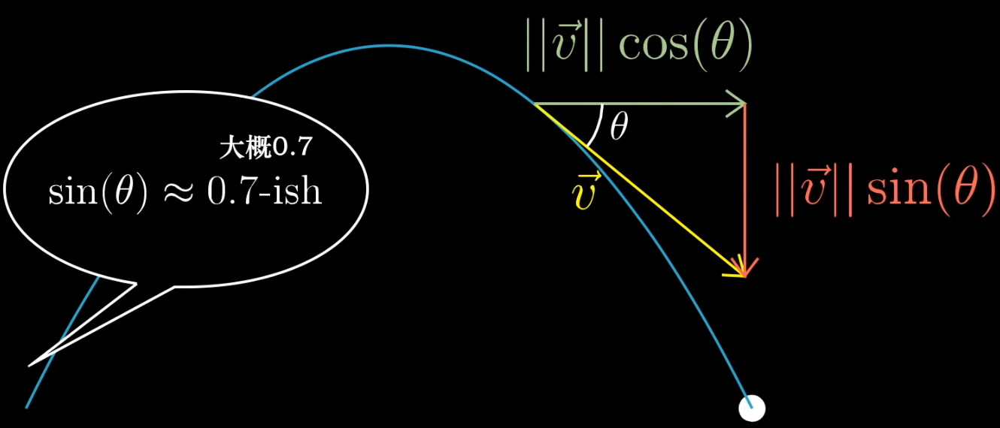
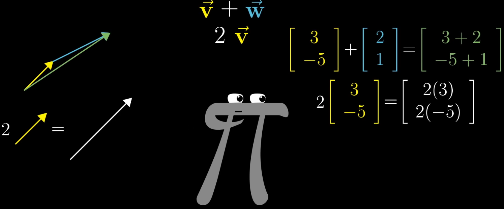

【阅读时间】
【内容简介】**将只停留在数值运算和公式的线性代数推进到可视化几何直观（Visual Geometric Intuition）的领悟上**，3B1B的系列视频的笔记，动图也都来自于视频。内容涉及到基变换，叉积，逆矩阵，点积，特征向量与特征值
<!-- more -->

在笔记开始之前，想象**学习一个事物（概念）**的场景：我们需要学习**正弦函数**，$\sin (x)$，非常不幸的是，你遇到了一本相当装逼的教材，它告诉你，正弦函数是这样的：
$$
\sin (x)
$$
<% raw %>
$$
\sin (x) = x - \frac{x^3}{3!} + \frac{x^5}{5!} + \cdots + (-1)^n\frac{x^{2n+1}}{(2n+1)!} + \cdots
$$
<% endraw %>

的确很厉害的样子，并且，计算器就是这样算 $\sin (x)$，知道了这个的确“挺酷的”。对你来说，你的作业可能就是回家把 $x= \frac{\pi}{6}$ 带到公式里面，发现，好神奇！竟然越算越接近`0.5`。此时你对$\sin (x)$与三角形之间的**几何直观**只有一些模糊的概念。这样的学习过程就十分**悲催**了。为什么呢？

再假设一个场景，接下来，物理课，正弦函数随处可见，下图场景中，其他人能快速的大概估计出这个值是`0.7`。而刚“学过”正弦函数的你，内心戏可能是这样的：这些人忒diao了吧？你莫不是在玩我？

你可能会觉得这些做物理的人脑子也太强了，我弱爆了。其实，你需要**只是一个几何直观的灌输而已**，这也从侧面佐证了一个**好的老师（这里的好老师真的不是他本身的学术能力有多强，而在于他擅不擅长站在学习者的角度的修正教学方法，甚至，模拟学生的学习过程提前预知所需要的基础概念）**是有多么重要。必须强调，教学不同层次的人：初学，入门，掌握，理解，都是不同的，所需要的角度，方式都会完全不同。更加不幸的是，**为了能更加通用的用理论是描述现实生活中的规律，人类已经做了很多工作，我们常说：越通用，越抽象（越难以理解）**。这对于初学者来说堪称一段噩梦

这个例子，比较极端，但只为强调一件事：**直观理解很重要，或者说，学习方法很重要**。即**你如何直观的去理解（可能是几何的，或是现实中的具体例子）一个抽象的事物，并层次化的建立知识与知识间的联系，构建并健壮属于自己的知识图谱**。个人观点是，这种【学习方法】是最高效，它唯一的**难度**在于，需要一定的基础知识打底，一定的**量变结合方法论**（点拨或领悟）就是**质变**。换句话说，想躺着学习？不存在的

根据生物学家我们知道，人对**具体的事物**（动画＞图形＞数字＞文字）更敏感，记忆速度更快。**这篇笔记的对象3B1B团队生产的内容**目的就是从**为了帮助人们建立直观概念**的角度来教学，在如今中国应试教育风行的大背景下，它会**超越你的认知：学习如追番般期待**，真不是一个调侃！

我是**极度反对现代大学的线性代数课程中（甚至数学类课程）的教学方法的**，在计算上（做题）花费了大量时间。而工程中，有计算机，绝不会有任何一个人去笔算矩阵的逆或特征值。如果现在的老师反驳：做计算的目的是为了让你通过大量的联系（重复）去记牢概念，我也一直坚信：**学习知识的最快捷径是带有思考的重复**，但那是**带思考的重复**，有一些**直观的方法**在帮助你理解和记忆上比**做题**有效率的多

> 注解，因为这是一篇个人笔记，我个人已经深刻理解的内容，或者我觉得是很基本的内容我会略过或默认。好消息是，我自己也是一个理解力非常捉急的人，所以还是会比较详细的

# 向量究竟是什么

> 引入一些数作为**坐标**是一种鲁莽的行为 ——赫尔曼·外尔
> The introduction of numbers as coordinates is an act of violence - Hermann Weyl

## 向量的定义 What

对于向量的这个概念，大家一定并不陌生，但是这次让我们从数学，物理，计算机三个角度来看待如何定义这个【向量】这个概念

### 物理专业角度

- 向量是**空间中的箭头**
- 决定一个向量的是：**它的长度和它所指的方向**

### 计算机专业角度

- 向量是**有序的数字列表**
- 向量不过是“列表”一个花哨的说法
- 向量的维度等于“列表”的长度

### 数学专业角度

从数学来说，它的本质就是通用和抽象，所以，数学家希望概括这两种观点

- 向量可以是任何东西，只需要保证：**两个向量相加及数字与向量相乘是有意义的即可**
- **向量加法**和**向量乘法**贯穿线性代数始终，十分重要

可以通过上图直观的感受到数学家（这个很牛逼的灰色的$\pi$）在想什么，有种【大道】的逼格。左边是物理角度，右边是计算机角度，但是很抱歉，**我能用一些抽象的定义和约束让你们变成一个东西**

## 坐标系

把向量至于坐标系中，**坐标正负表示方向**，**原点为起点**，可完美把两个不同的角度融合

- 向量加法
  - 物理：首尾相连 Motion
  - 计算机：坐标相加
- 向量乘法
  - 物理：缩放 Scaling
  - 计算机：坐标和比例相乘

#线性组合、张成的空间与基

#矩阵与线性变换

#矩阵乘法与线性变换复合

#行列式

#逆矩阵、列空间与零空间

#点积与叉积

#基变换

#特征向量与特征值

#抽象向量空间

 

