【阅读时间】29min - 35min - 11348 words
【内容简介】此文潜在面向群体是对区块链或比特币的运行原理完全不了解的人。所以会从**用户需求**的角度出发，**一步一步发明区块链（或者说比特币，因为两者互相依存）**，在此之后的内容有关比特币与金融，ICO，竞争币等，可选择性阅读。
<!-- more -->

[如果有帮助求知乎点个赞，感谢！](https://www.zhihu.com/question/37290469/answer/236442981)

> **因为贪婪，所以信任**

# 加密货币

在一步一步发明发明比特币之前，解释几个直观的认知：

我们常说的比特币，是**加密货币（Cryptocurrency）**的一种，而加密货币**实现去中心化**的最关键的技术是**区块链**

有些地方可能把加密货币又称为数字货币（或称电子货币），但实际上，加密货币是数字货币的子集，同为子集的还有**虚拟货币**（如Q币），**加密货币**的称谓要更加专业

加密货币一定具有下列三个特点

- **去中心的清算**
- **分布式的记账**
- **离散化的支付**

**为了实现这些特点**，需要使用到**区块链技术**。这里的区块链技术是一个很广义的范畴，它包含了密码学，算法等很多不同的内容，其中最精彩的点子，可算是**工作量证明 = 共识信用**了

# 一步一步发明比特币

## 第一个用户需求 - 账本和电子签名的由来

> 第一个用户需求描述了**中心化清算系统**几个关键内容的由来，只对区块链感兴趣的读者可以跳过

经济体的蓬勃发展离不开**交易**。在交易过程中，人们早已发现使用一般等价物（如金银）十分麻烦，发明了纸币（最早的来自中国，北宋时代四川地区的纸币交子的**清算体系**，是**生产力发展的必然产物，最终的目标是提高生产效率**），现如今，人们发现，**携带现金也很麻烦**

这是第一个基本用户需求：**摆脱现金进行交易带来的不便**

**【解决办法】**几个用户使用**公共账本**记录转账记录，**月底结算**，**账本公开**，每个人都可以修改，也就是说可以在上面添加新行（一笔交易），如`小明转账给小红10块钱`

### 产生的问题1：身份问题

在这个账本条目上我们无法确认交易双方`小明`和`小红`是否是本人，可能出现伪造（逍遥法外电影中的伪造支票）

**【解决办法】**使用**电子签名**，即公钥 - 私钥对

记住，**电子签名被发明的核心目的**是希望在电子文档也能有一个类似与现实中个人笔迹的签名，目的一定是：**确认写这个签名的人是本人，即身份确认（验证）**

私钥顾名思义，也叫做密钥，是你**本人需要需要妥善保管和保存的**
$$
Sign(\text{信息},私钥) = \text{电子签名}
$$
Sign在这里是一个函数，可以理解为**一连串计算（变换）**，这一连串计算有一个特点，就是**输入值只要改变一点点**，输出就会**完全改变**。信息和私钥一起，可以得到一个电子签名。并且这个电子签名不能被轻易的复制到其他信息里，原因是因为每一个电子签名都和**这一段信息**有关联。
$$
Verify(\text{信息},\text{电子签名},\text{公钥}) = \text{真/假}
$$
在进行**验证**的时候，Verify也是一个函数，**输入值是信息，电子签名，公钥，输出是一个True or False**，来判断这个**电子签名**是真的还是假的。

这个时候可能有人就要问了，这个电子签名我难道不能试出来吗？很不幸，这是一个有**256bit的1/0字符串**，可能性是2的256次方，2的10次方是1024，我只能告诉你这么多了。

解释完电子签名，我们来看看实例。`小明`使用自己的私钥加上`小明转给小红10块钱`**这段话**通过Sign函数生成一个签名（256位），把签名放在这条转账信息的后面，通过之前的讲解，这个签名就能保证`小明`已经过目了，并且说：“这真的是我`小明`，不用怀疑了！肯定是我”

直观结果是，我们可以利用**密码学的手段**，只要有对应人的**数字签名**，我们保证`小明`和`小红`的**身份能被100%确认真实**

但是这个解决方案有一个小漏洞：可以**复制同一行信息**来伪造交易记录，解决的办法是添加一个**这笔交易独有的信息（比如时间戳）**

### 产生的问题2：欠债跑路问题

如果`小明`在此时账户上已经没有足够的余额进行支付，就会出现超支问题

**【解决办法】**添加余额记录，此时就不可避免的需要一个**中间担保人（国家？信誉机构？银行？）**为`小明`进行余额担保

### 一个大家都遵守的协议

此时，现代金融体系的框架基本建立完毕，协议内容是

- 任何人都可以在**账本上添加新行**
- 固定时间间隔时用**真金白银进行清算**
- 只有有**签名的交易**是有效的
- 中间担保的人**保证不可超支**

此时发现一个很有趣的发现，这个比较严谨的协议有一个特点：**如果所有人都按照这个协议来办事，我们可以用任何形式的东西来代替人民币了**，换句话说，就是我根本不关心你在账本上添加的新行的交易内容是什么，可以是任何东西

利用这个提出需求再解决问题的过程，强化一个**认知**：**货币 = 交易记录（账本），即货币的本质是交易记录**，在这背后，有一个前提是，货币的另一个本质是一种**共识**，我们都信任它有价值的共识

## 第二个用户需求：账本放在哪里？

传统的（现在的）解决方案当时是，使用中心代理-**银行**，来存放账本

既然是第二个用户需求，那肯定就是因为现在的解决方案大家都**不满意**

### 核心需求：去中心化

中心化的痛点大致可以说几点

- 银行**效率低下**，一笔跨国转账的等待时间较长
- **胖银行金融体系**因部分准备金制度等等方便的规则，能抬升杠杆，产生金融泡沫，进一步诱发金融危机
- **私有财产神圣不可侵犯**是精英与平民，剥削与被剥削者几个世纪以来博弈的风暴中心

当然还有很多没有提到（比如好处，控制经济发展速度，调控供需平衡等），总之，是一种一直饱受诟病的清算方式，此时，中本聪在2009年横空出世，他提出了一种全新的**清算方法**，并且真正解决了陌生人间信用的问题！接下来就是真正的一步一步的发明比特币了

### 如何实现分布记账（去中心化）

为了去中心化，我们可以反其道而行之：每个用户保存账本，分布记账。用户产生一笔交易就**将这笔交易广播到到网络上所有的节点上**，这样不就完美的去中心化了？

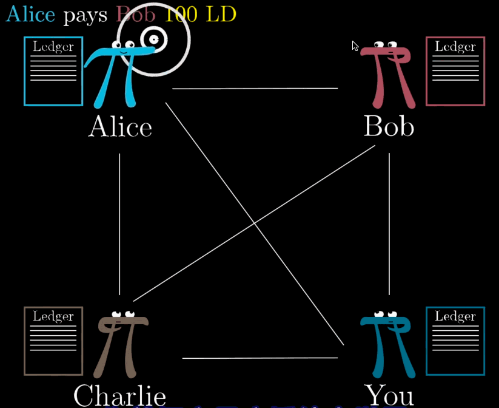

只要是明眼人都能发现，太天真的，这个方法行不通。若行不通，那就把行不通的原因总结出来

> 遇到问题，总结不可行的原因，寻找解决方案。这是整个人类不断前进的核心最小单位

#### 问题核心

如何让所有人都同意这个新账本？如何保持这些账本同步？有一笔交易发生时，如何让其他人都听到并相信这一笔交易呢？

这些问题才是真正的核心：**是否能在协议（办法，规则）中添加几行，找到办法，来决定是否接受交易，并确定交易顺序，使你可以放心的相信，世界上遵守同一协议的所有人手上的账本都和你的一模一样呢？**（问题描述值得品读，只有抽象出问题才能更好的去寻找解决方案）

#### ☆解决方案

解决的思路是：哪个账本的**计算工作量大**，就信任哪个账本。换个角度来说是**【让交易欺诈和账本不一的情形的计算力成本高到不能接受甚至完全不可行】**

##### 1、密码学：哈希函数

哈希函数，**输入**可以是任意信息或者文件，**输出**是固定长度的比特串。例如256bit的1/0串，这个输出叫做这个信息的**“哈希值”或者“摘要”（digest）**。SHA256就是一个哈希函数

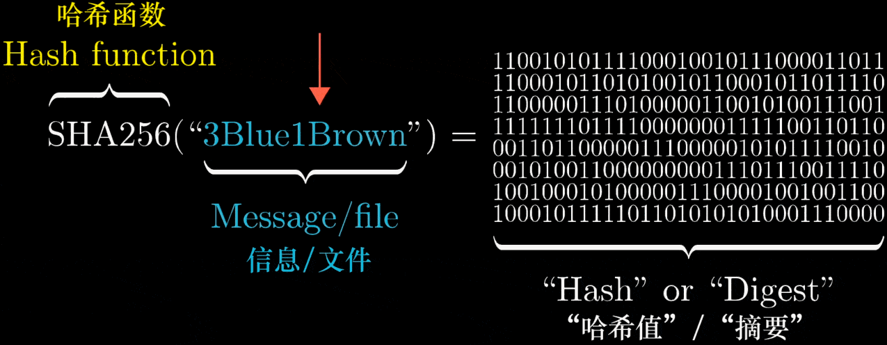

密码哈希函数有几个特点

- 特点是**输入值稍微变化后，结果就会有很大的不同，完全无法预测不同输入间的规律**
- **逆向计算**不可行，只能使用试错法（穷举法），解空间 $2^{256}$ 

在每一个账本后添加一个**特殊数字**，对整个列表使用SHA256，我们要求这个**特殊数字**可以使得输出值的开头有**30个零**（关于如何确定0的个数问题，在后面部分有详细的说明）

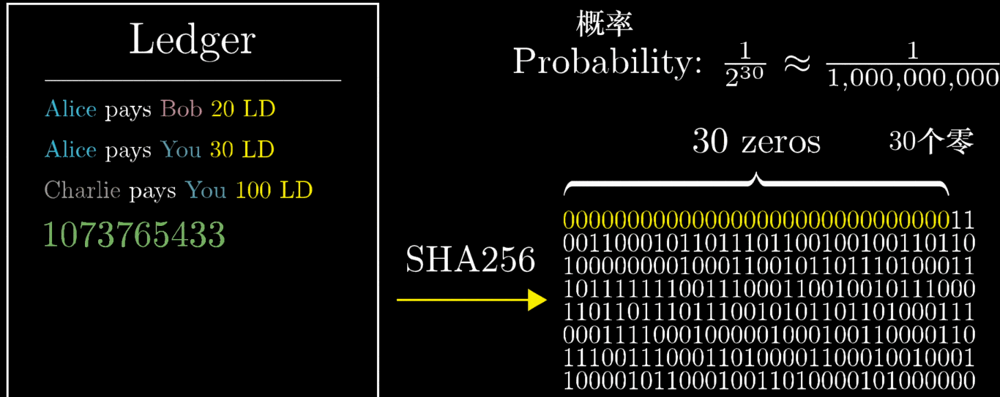

根据之前说过SHA256的性质：输入变化输出不可预测，找到这个特殊数字唯一的办法就是穷举。换言之，你很容易就证明了他们**进行了海量的计算**。而这个**特殊数字就叫做工作量证明**（proof of work）

这就意味着，所有的工作量证明就对应了交易列表（账本 Ledger），如果你修改了一个交易，哪怕只是其中一个字符，就会完全改变哈希值，就得**重做工作量证明**，直观动图如下

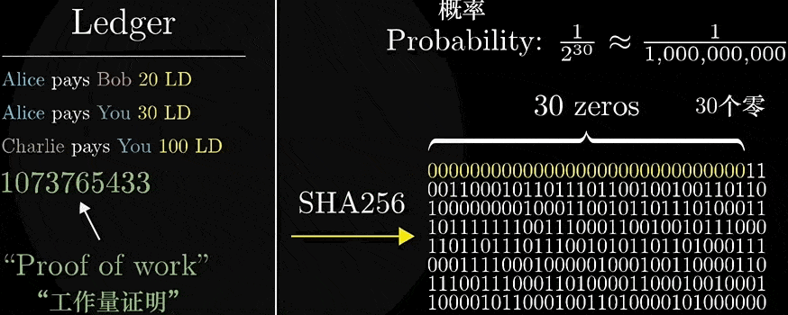

##### 2、区块链 - 信任与共识的基石

每一个小账本被称为**区块**，**每一个不同的区块链协议（产生不同的加密货币）**都会规定每一个**区块的大小**（最初比特币为1M）	

**账本组成区块，区块构成链表，区块的头包含前一块的哈希值，这就是区块链**

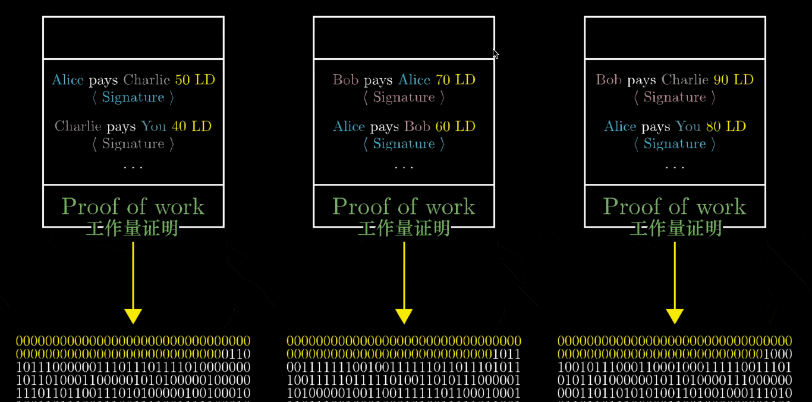

如此一来，**任何人就不能随意修改其中的内容，或者交换顺序**。如果你这么做，意味着**你需要重新计算所有的特殊数字**

规定，**允许世界上的每一个人建造区块**。每一个新建区块的人（找到了这个特殊数字 - SHA256值有30个零）都能获得奖励，对于**新建区块的这部分人（矿工）**来说

- 没有发送者信息，不需要签名
- 每一个新区块都会给**整个币种增加新的虚拟（加密）货币**
- 新建区块的过程又被称为“挖矿”：需要大量工作量并且可以向整个经济体注入新的货币
- 挖矿的工作是：**接受交易信息，建造区块，把区块广播出去，然后得到新的钱作为奖励**
- 对每个矿工来说，每个区块就像一个**小彩票**，所有人都在拼命快速猜数字，直到有一个幸运儿找到了一个**特殊数字**，**使得整个区块的哈希值开头有许多个零，就能得到奖励**。我记得有一个知乎答主给了一个形象的比喻，区块链就像一个拥有貌美如花女儿（区块）的国王，有很多的青年翘首以盼，而国王的方法是**出了一道很难得题目**让所有的青年计算（学习改变人生），谁算的快（在计算哈希值过程也可能是运气好）就能抱得美人归
- **对于想用这个系统来收付款的用户来说，他们不需要收听所有的交易，而只要收听矿工们广播出来的区块，然后更新到自己保存的区块链中就可以了**

##### 3、51%算力-共识攻击

这里有一个小漏洞，因为网络的延迟或者有人在篡改区块链等因素，你作为一个收听网络广播的用户，如果同时接受到两条不同的区块链怎么办？其中的交易信息发生了冲突

> 注：区块链本身就是最终的大账本，发生交易的唯一方法就是把你的交易加入到大账本上。具体来说，就是让矿工把你的交易记录加入它新挖到的区块中，并把这个区块链接到区块链上。链表的纽带，当然就是工作量证明

对于上面的问题，用户的解决方案也比较简单：即，**只保留最长的，也就是包含的工作量最大的那一条**

这里有一个Trick，**即所谓信任工作量最大不仅仅是出【一道难题】，还通过等待多个区块的产生引入世界上所有矿工之间的博弈**（吃瓜群众，坐看大戏，谁厉害我选谁，你们尽管斗）

个人观点：区块链的Idea最核心的创新就是从技术上把**信任和贪婪画了等号**。因为贪婪（希望去竞争建立区块的建立和交易费）所以信任（全网算力越大，用户越放心），这句话甚至带上了些许哲学和传奇的色彩

对于用户来说，是这样一种情景

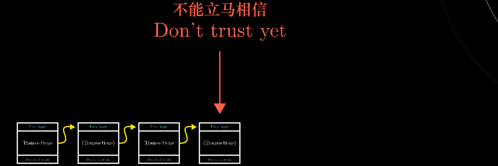

其中的原因是，你可以假设Alice希望篡改一个交易信息，那么就意味着Alice需要不断的通过计算维护这个区块链了。**也就是说每一次有新的区块链产生，Alice都需要不断的抢到这个彩票**，理论上来说，他至少必须拥有全网51%以上的算力才能做到这一点，更多的，**随着用户等待区块的增加，这个难度，幂次上升**，在7-8个区块链产生后，概率上来讲，就是**绝对信任**

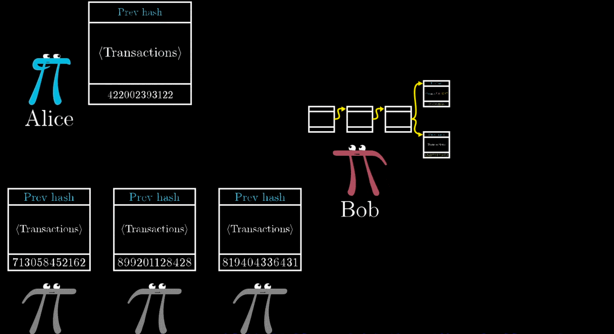

此时

- 我们用**数字签名**保证了不能伪造交易记录
- 用**区块链及工作量证明**保证了不能篡改其中的信息

这两点，就完成了：**证明区块链的每一条交易记录都是可信的这一终极目标**

### 总结 - 系统可行性分析

只需给出一个命题来思考：**我们如何才能在这个系统下骗人呢**？

- 如果你想篡改一笔不存在的交易记录，那么你必须比所有人都算的快，赢得这个彩票
- 但**所有用户**会继续收听其他矿工的广播
- 所以为了让所有用户继续相信这个伪造的区块
- 你必须投入自己所有的工作量，不断给**篡改后的区块链分叉**增添新的区块
- **记住：根据协议，所有用户会一直信任他所知道的最长的链**
- 是的，你**持续的竞争过世界上所有的矿工**的概率或者说代价，实在太大了，得不偿失（其实**法律也是一样的道理**，它强制给违法的人给予惩罚，让违法者付出他们不能承受的代价了保证公平和社会稳定运行）
- 注意，作为一个用户，你不能立马相信你所听到的最新区块，而是应该等待多几个区块被创建过后，再确认这的确是世界所有人都在使用的区块链

## 发明过程中的关键点

- 电子签名 Digital Signatures
- 公共账本就是货币 The Ledger is the currency
- 去中心化 Decentralize
- 工作量证明 Proof of work
- 区块链 Block Chain

# 比特币技术

到这里，已经发明了比特币，**解决了去中心化的信任这一难题**。只对比特币和区块链是什么这个问题感兴趣的读者，可以停在这里了，希望大家可以在我的叙述中解决一些困惑！鞠躬！

针对比特币的一些实现的内在细节，继续在探索和学习的道路上披荆斩棘。新技术，新点子，要拥抱它，使用它，判断它，**必须先追根究底了解它**。

我们知道区块链中记载的核心内容，对于比特币（加密货币）来说就是**转账记录**。但是，**一个概念真正落地成大众可以用的服务**，有很多技术上，协议上的细节。接下里的部分主要探讨一些**比特币具体实现方面的细节**，如网络节点构成，比特币的计算难度系数，比特币总量的由来，比特币一笔交易发生的内部细节等

## 比特币网络节点的构成

比特币网络是一种**点对点的数字现金系统（P2P）**，网络节点中每台机器都彼此对等。P2P网络不存在任何服务端、层级关系或者中心化服务。

### 节点类型与分工

一个全功能节点包含上述4个模块【钱包**W**allet】【矿工**M**iner】【完整区块链full **B**lock-chain database】【网络路由节点**N**etwork routing】

- 【网络路由节点】使得节点具有**参与验证并传播交易与区块信息，发现监听并维持点对点的链接**的能力
- 【完整区块链】具有此模块的节点被称为：全节点。它能够**独自自主的校验所有交易**，不需要任何其他信息。
- 【钱包】比特币的所有权是通过数字密钥、比特币地址和数字签名来确定的，数字密钥实际上并不是存储在网络中，而是由用户生成并存储在一个文件或简单的数据库中，称为钱包。有些节点仅仅保留**区块链的一部分**，通过一种”简易支付验证“（SPV Simplified Payment Verification）的方法来完成交易
- 【矿工】挖矿节点以相互竞争的方式创造新的区块。有一些挖矿节点也是全节点，可以独立挖矿；还有一些参与矿池挖矿的节点是轻量级节点，**必须依赖矿池服务器维护全节点进行工作**

拥有全部四个模块被称之为**核心客户端（Bitcoin Core）**，除了这些主要节点类型外，还有一些服务器及节点运行其他协议，如特殊矿池挖矿协议、轻量级客户端访问协议。

下表为扩展比特币网络的不同节点类型

|                    图示                    |      名称       |                  说明                  |
| :--------------------------------------: | :-----------: | :----------------------------------: |
|  |     独立矿工      |              具有完整区块链副本               |
|  |    完整区块链节点    |     此种节点有时有中继作用，不断收听网络广播，维护完整区块链     |
|  |   轻量(SPV)钱包   |    移动端，或者不想太过于笨重的桌面端，只需要进行交易广播操作     |
|  |    矿池协议服务器    |      将运行其他协议的节点，连接至P2P网络的网关路由器       |
|  |     挖矿节点      | 不具有区块链，但具备Stratum协议的节点或其他矿池挖矿协议的网络节点 |
|  | 轻量 Stratum 钱包 |      不具有区块链的钱包、运行Stratum协议的网络节点      |

### 扩展比特币网络

要在全世界的网络中完成整个的交易，下图描述了一个扩展比特币网络，它包含了多重类型的节点、网关服务器、边缘路由器、钱包客户端以及它们互相连接所需要的各类协议，比特币互相连接的接口一般使用`8333端口`

可以参看这个文章了解Stratum协议，[Stratum协议详解](http://www.8btc.com/stratum_protocol)

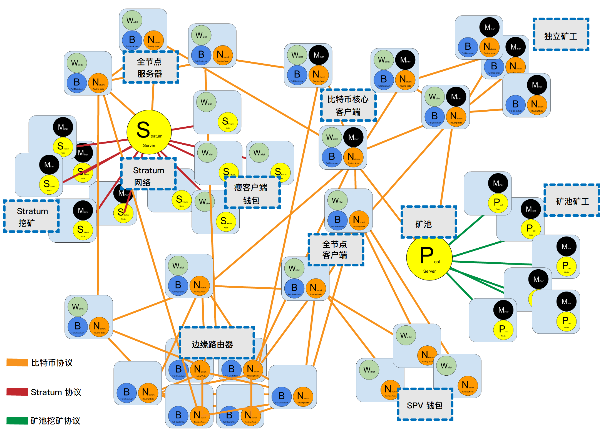

## 如何控制区块产生速度恒定

### 难度系数

我们在发明比特币的过程已经详细说明了**工作量证明**寻找一个特殊数字使得SHA256函数的输出字符串的前`n`位是零

对于每一种不同的加密货币来说，都有**一个值**需要在建立货币的时候时候被定义，即**每一个新区块在当前全网算力的条件被发现的【平均时间】**，这也是难度系数的由来

>  比特币10分钟；以太坊15秒；瑞波币3.5秒；莱特币2.5分钟

抛开代码算法层面来说，实现方法就是通过找前`n`位是0的方法。从概率角度来说，n值越大，意味找到这个这个数的解范围越小。

随着需求`0`的数目一个一个增加，**需要的计算时间将会程指数增长**。

那么肯定会问，这个难度值如何动态调整？由谁调整？

### 难度调整方式

难度的调整实在每个完整节点中自动发生的。如果网络发现区块产生速率比10分钟要快时会增加难度。如果发现比10分钟慢时则降低难度。

例如比特币中的是这样定义的：每2016个区块后计算生成它们花费的时长，比上20160（14天）调整一次。有人可能会问，如果在这十四天内计算能力暴涨怎么办，其实这个10分钟的区块新建间隔的规定也只是一个估计要求，真实情况下，**这个时间会偏离10分钟这个设定值很多，但是这种偏差并不会对整个区块链的运行产生影响**

## 比特币总量的由来

我们已经知道，矿工没新建一个区块就可以得到一定数量的比特币作为奖励，最开始，一个区块可以得到`50BTC`的奖励，之后每210000个区块，奖励减半，直到2140年，所有的比特币将会发放完毕，可以得到公式
$$
Total = 210000 \times(50 + 25 + 12.5 + \ldots) = 20999999980 \approx \text{2100万}
$$
而这个规则不同的竞争币种都可以自由设置。但是因为**交易费的存在**，挖矿的人还是会有收益，否则无法建立新的区块，那么整个比特币网络就瘫痪了

## 比特币的交易处理能力

### 现在比特币区块链的区块信息

我现在直接从[BLOCKCHAIN](https://blockchain.info/)上，在我写下这句话的时候，最新的区块是情况

|  区块高度  | 存在时间 | 交易数量 |   交易额    |  创建人(矿池)  | 大小(KB)  | 重量(kWU) |
| :----: | :--: | :--: | :------: | :-------: | :-----: | :-----: |
| 486883 | 3分钟  | 2126 | 25992.38 |  BTC.TOP  | 999.34  | 3917.54 |
| 486882 | 23分钟 | 2422 | 33926.89 | BTCC Pool | 1034.39 | 3996.58 |
| 486881 | 51分钟 | 358  | 4480.22  |  BTC.TOP  | 191.92  | 718.14  |
| 486880 | 53分钟 | 352  | 3770.26  |  BTC.TOP  | 197.27  | 715.72  |

其中的重量是指的实际存储的大小，这个值和交易协议有关，其实可以忽略。非常幸运的是，**这几个区块放佛是专门为讲解这一节而出现的**，这可能是天意吧

另外插一句，你会发现**平均区块建立间隔时间**，的确和10分钟这个设计值差距很大吧

### 区块容量

比特币从被创建时，或者说源代码中规定了，区块容量是1M。最初设计成1M的原因一方面，**防止DOS攻击**。另一方面，当年中本聪在创建区块链的时候的容量是32M，但是他通过一个说明为”Clear up“这样毫不起眼的Commit把区块容量改成了1M，为**防止区块链体积增长过快**，为区块容量这个问题添加了些神秘色彩。好吧，我承认，中本聪就已经非常具有神秘色彩了，是在神秘色彩上添上了些故事

通过上表我们知道，1M的容量意味着比特币最大的处理交易数量在约2400（486882区块1034.39的大小很接近了），在给出[一张时间和每秒交易数量的关系图表](http://charts.woobull.com/bitcoin-transactions-per-second/)(交互表格点击链接)

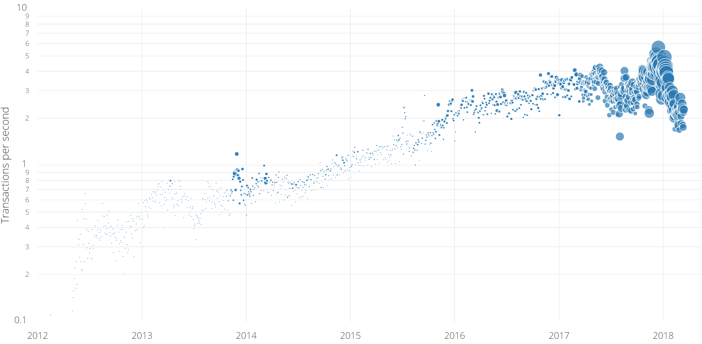

> 这是一张对数图，纵坐标是每秒交易数量，横坐标是时间。其中，蓝色圆圈的大小代表的是比特币内存池（mempool）的大小（交易在等待矿工处理之前都会暂时存在这里）。

一句话总结，这是一个拥堵的网络，已经重负不堪。

再来看一张[比特币交易费和区块使用率之间的关系图](http://charts.woobull.com/bitcoin-blocksize-fees/)(交互表格可以点击链接)

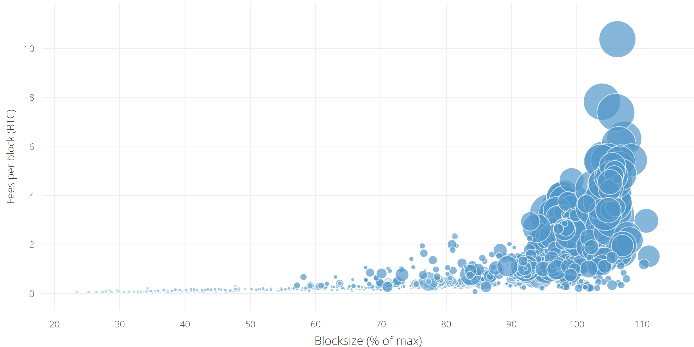

> 蓝色的圈大小是Mempool的大小。横坐标是区块容量的使用情况，纵坐标是每一个区块的可以得到的交易费用。

手续费随区块使用率开始增长，甚至出现了4BTC一个区块2400笔交易的情况，意味着挖到这个区块的人通过交易费得到的汇报接近了本身建立区块的回报

有一个结论是，扩容后，因为每一个区块的交易承载量增加，矿工的交易费收入肯定会减少。因为，通过上表可以发现，只有当区块使用程度接近95%时候，交易费才有明显的增长

再看一张[用户执行交易需要等待的时长和区块使用比例间关系的图表](http://charts.woobull.com/bitcoin-blocksize-confirm-time/)(交互图表点击链接)

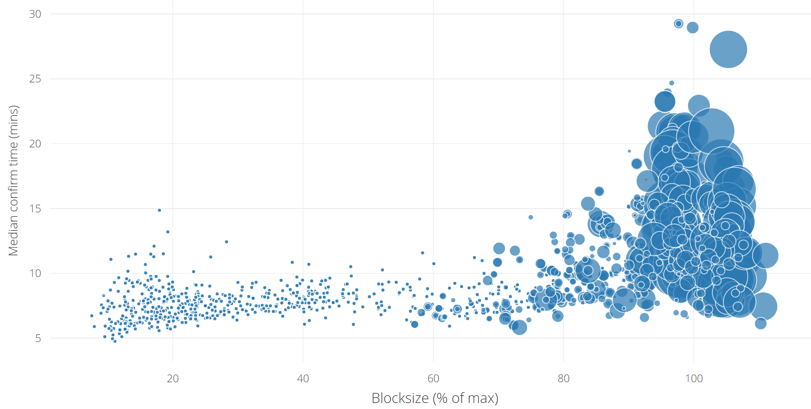

> 蓝色的圈大小是Mempool的大小。横坐标是区块容量的使用情况，纵坐标是用户平均需要等待的时间，单位是分钟。

通过上面三张表我们可以知道，矿工的计算力是整个区块链信用的基石（记住贪婪=信任），所以对矿工的激励不能少，而对于用户来说，当然希望自己的交易越快速完成越好。

对于矿工来说，区块使用率超过95%是一个很好的信号，那意味着我可以拿到更多的奖励。奖励太低，在区块建立奖励越来越少的情况下，安全性（信任）就慢慢的得不到保障。这么说来，**这也就变成了一个Trade-off博弈过程**

分析下来，**类似门罗币（menero）实现的根据网络负载来动态调整区块容量的设计似乎很合理**

### 比特币扩容之争

这是一场复杂的博弈斗争，使用隔离见证增长区块容量，并出现了**比特币现金**这个新的币种。

如果想要了解这里面的很多技术，英文是必须过硬的，因为比特币代码开源，可以随意fork，只要英文功底过硬，阅读白皮书，文档等，这些不同技术的处理方法都是能够学到的

## 比特币的一笔交易过程中到底发生了什么

我们可以确认的是，每一笔都将记录在大账本中，那么我们需要研究的内容，就是区块中交易内容内的具体数据结构

### 交易结构

每一个交易块包含的内容如下表所示

|     大小      |  字段  |      描述       |
| :---------: | :--: | :-----------: |
|   4 bytes   |  版本  |  明确这笔交易参照的规则  |
| 1 - 9 bytes | 输入数量 |    输入值的数量     |
|     不定      |  输入  | **一个或多个交易输入** |
| 1 - 9 bytes | 输出数量 |    输出值的数量     |
|     不定      |  输出  | **一个或多个交易输出** |
|   4 bytes   | 时钟时间 |  UNIX时间戳或区块号  |

最后这个值是解锁时间，定义了能被加到区块链里的最早交易时间。大多是时候设为0，表示**立马执行**。

一笔比特币交易是一个含有**输入值**和**输出值**的**数据结构**。该数据结构**包含了将一笔资金从初始点（输入值）转移至目标地址（输出值）的代码信息**。比特币交易的输入值和输出值与账号或者身份信息无关。可以把它理解为一种**被特定秘密信息锁定的一定数量的比特币**。只有拥**有者或者知道这个秘密信息的人**可以解锁

### 交易的输入和输出

比特币交易的基本单位是**未经使用的一个交易输出**，简称UTXO（unspent transaction outputs）

可以把UTXO类比为我们使用的**人民币1，5，10，20，50，100的面值**，对于UTXO来说，它的面值可以是一”聪“的任意倍数（1BTC等于一亿聪）**但是**这个有着任意面值的”人民币“不能随意打开，还被加上一道类似**红包支付口令的密码**，只有拥有这个密码的人才可以使用这个UTXO，UTXO包含，币值+一段代码（锁，只有有钥匙的人才能打开）

被交易消耗的UTXO被称为交易输入，由交易创建的UTXO被称为交易输出

#### 交易输出

**不同面值的UTXO是由交易输出来提供的**。你可以想象你需要购买一个3.1BTC的物品，你并不能从你的钱包中找到几个UTXO来得到3.1BTC，但是你刚好拥有一个4BTC的UTXO，你使用这个UTXO作为付款，那么你需要自己**手动构建一个0.9的UTXO返还给你自己**。

一个交易输出包含两个部分

- 一定量的比特币。被命名为“聪”（satoshis）
- 一个**锁定脚本**。给这个UTXO上锁，保证只有**收款人地址**的私钥才可以打开

#### 交易输入

每个交易输入是在构造的一笔交易（使用UTXO），比如你需要支付0.015BTC，钱包会寻找一个0.01BTC和0.005BTC的UTXO来组成这一笔交易。交易输入中还会**包含一个解锁脚本**，这是一个签名，可以类比成支付宝红包密码的口令

#### 交易费

交易费 = 求和（所有输入） - 求和（所有输出）

这里有一个比较有意思的地方，就是因为找零的输出UTXO是交易的发起这自己构建的，如果很不幸，你忘记了自己构建找零的UTXO，那么这些多余的BTC就会变成矿工的劳务费

例如，我需要和小明进行交易，需要购买一个商品，花费`0.8BTC`，为了确保这笔交易能被更快的处理（添加到大账本上），我要在其中添加一笔交易费，假设`0.01BTC`（忽略人傻钱多），那就意味着这笔交易会需要我从钱包中找到几个UTXO能组成`0.81BTC`。但如果我的钱包内找不出这样的UTXO，只有一个`1BTC`的UTXO可用，那么我就需要构建一个`0.19BTC`的UTXO作为找零回到自己的钱包

**交易费只和交易字段使用的字节大小有关，与参与交易的比特币币值无关**。UTXO是有尺寸的，比如某人想支付一笔很大的BTC交易，但是他的钱包中有很多小尺寸的UTXO，如果加入了很多个UTXO，就以为这他的交易会变复杂且尺寸大。

#### 解锁和锁定脚本

在实际实现的时候，这个“支付宝红包口令”被称为脚本，是一种基于逆波兰表示法的基于堆栈的执行语言。具体细节感兴趣的读者可以去[比特币的Github](https://github.com/bitcoin/bitcoin)研究代码。关于脚本有很多细节上的定义和实现方法，这里限于篇幅不展开描述了

### 矿工费和优先级

我们知道，**每一笔交易都是广播到区块链上，由矿工决定是不是加入到新区块上的**。那么这里就会涉及到一个问题，谁的交易的优先级更高，是先来后到？还是谁给前多谁就能加入到新区块中？

在[区块容量](#区块容量)一节中，有一张图表直观的展示了现在网络中一笔交易的等待时间，其中最长的，也就是30分钟，如果你不是一个超级急性子，很多时候还是可以接受的（毕竟跨国转账1-2个工作日）

优先级 = 输入值块龄 * 输出值块龄 / 交易总长度

一个交易想成为**“较高优先级”**，需满足条件：**优先值大于57600000**，等价于1个BTC，年龄为1天，交易的大小为250字节

区块中前50KB的字节是保留给“较高优先级”的，其实这一机制也保证了一笔交易不会等待时间无现长。但是我们要知道，内存池（存放待处理交易的位置）中的交易，如果在没有处理后消失，所以钱包必须拥有不断重新广播未被处理交易的功能

### 创币交易 - Coinbase

每一个**新建立的区块**，都会有新的比特币作为奖励被产生，这个交易是一个特殊交易，被称为**创币交易（Coinbase奖励）**

创币交易中不存在解锁脚本（也叫ScriptSig字段），被Coinbase的数据取代，长度最小2字节，最大100字节，除了开始的几个自己以外，矿工可以任意使用Coinbase的其他部分。比如创世区块中，Coinbase的输入中的字段是：The Times 03/Jan/2009 Chancellor on brink of second bailout for banks，是泰晤士日报当天的头版文章标题：财政大臣将再次对银行施以援手。

## Merkle树

**每个区块中的所有交易，都是用Merkle树来表示的**。换句话说，交易的存储数据结构是，Merkle树

### 什么是Merkle树

Merkle树是一种**哈希二叉树**，它可以用来进行**快速查找和检验大规模数据完整性**。对于比特币网络来说，使用Merkle树来存储交易信息的目的是为了**高效的查找和校验某笔交易的信息是否存在**

当N个数据元素经过加密（使用两次SHA256算法，也称double-SHA256），**至多**计算 $2log\_2(N)$ 次就能**检查出任意某元素是否在树中**

### 构造Merkle树

假设我们有A B C D四笔交易字段，首先需要把这四个数据Hash化。然后把这些哈细化的**数据通过串联相邻叶子节点**的哈希值然后哈希化。基本过程如下图所示

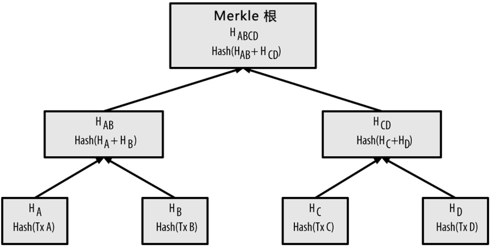

叶子节点必须是偶数（平衡树），如果遇到奇数的情况，把最后一个节点自身复制一个，凑偶

### Merkle树的效率

下表显示了证明区块中存在某笔交易所需转化为Merkle路径的数据量

| 交易数量  | 区块的近似大小 | 路径大小（哈希数量） | 路径大小（字节）  |
| :---: | :-----: | :--------: | :-------: |
|  16   |   4KB   |    4个哈希    | 128 bytes |
|  512  |  128KB  |    9个哈希    | 288 bytes |
| 2048  |  512KB  |   11个哈希    | 352 bytes |
| 65535 |  16MB   |   16个哈希    | 512 bytes |

可以发现，即使区块容量达到16MB规模，为证明交易存在的Merkle路径长度增长也极其缓慢（幂指数增长取对数变为线性增长）

### Merkle应用 - 简单支付验证节点（SPV）

我们知道，每当一笔新的交易产生的时候，我们必须**验证这笔交易是否真的存在**，在SPV节点中，不保存区块链，仅仅保存区块头。**使用认证路径或者Merkle路径来验证交易是否存在于区块中**

例如，一个SPV节点需要处理一笔支付，它**需要验证这笔交易在某个区块中是否存在**，才能决定是不是把这笔交易添加到这个区块中，那么它只需要接收少于1KB大小的，**有关区块头和Merkle路径的信息**，比接收完整区块（大约1MB）大小少了1千倍。简单来说，可以想象，Merkle树类似**一个数组**（这也是哈希表的最简单表示），**下标是区块字段**，下标对应**数组存储的内容是这笔交易是否存在的值（True or False）**

# 区块链（比特币）与金融

因为比特币具有价值，那就必须谈到它和金融的关系。

限于篇幅（太长了太可怕了，一个博客写2万字莫不是有病），这部分另起一篇：[链接（直接点不会打开新标签）](https://charlesliuyx.github.io/2017/09/25/%E5%8C%BA%E5%9D%97%E9%93%BE%EF%BC%88%E6%AF%94%E7%89%B9%E5%B8%81%EF%BC%89%E4%B8%8E%E9%87%91%E8%9E%8D/)，如果对**ICO和金融方面**感兴趣的读者欢迎移步讨论

# 竞争币和其他技术创新

所谓竞争币当然是利用区块链技术为即使，仿照比特币的基本协议架构进行的创新后的新币种，或者是新的区块链实现模式。这篇文章围绕什么是区块链展开，这部分的内容请移步**（持续更新）**[如何评估竞争币的价值与新技术创新（直接点不会打开新标签）](https://charlesliuyx.github.io/2017/09/25/%E7%8E%B0%E4%BB%A3%E5%8C%BA%E5%9D%97%E9%93%BE%E4%B8%8E%E6%96%B0%E6%8A%80%E6%9C%AF/)

其中谈到了工作量证明的其他替代手段；到底什么是智能合约；以太坊开发技术栈等

# 总结

感谢您看到这里，写这篇文章的目的一方面也是回答**区块链（比特币）到底是什么**这个困扰了自己很久的问题，另一方面，也是因为最近区块链技术非常火，需要**一些接地气的科普文**

比如最近最新的消息称一家保险公司，使用区块链技术来赔偿航班晚点2小时，基于以太坊智能合约第一款落地应用。

如果你已经对区块链的实现原理有了初步的认知，就明白这些应用利用了区块链的分布式特点。说到底，并没有**贪婪=信任工作量证明核心**，只是一种基于云的新型运用，也很有想法，但是**和比特币之类就没什么关系了**（当然，这是我的个人看法，最近区块链方面的有很多突破性技术，比如侧链，闪电网络等等，太多的新概念，新名词，新技术，对此，也只能不断学习）。

但你只需牢记，贪婪=信任，以太坊也是利用以太币这个媒介来实现了合约价值，中本聪用人内核的贪婪来给陌生人之间加上了信任的纽带，这个代价是永远不会变的。换句话说，如何抵抗共识攻击和安全漏洞是一个永远不会消失的议题。

一句话来说，万变不离其宗，道生一，一生二，二生三，三生万物。中本聪给了道，是个妙人，但是**万物**依旧有无穷可能。**信任作为一个人类社会一直以来的重要问题（痛点）**，为了解决它，出现了**权威机构进行信任背书（中心化）**。建立信任，一定要付出代价，天底下没有免费的午餐，最终这些技术都会回归于一个投入产出的博弈过程（Trade-off），梳理主干，抓住要点，才能游刃有余！

那么如何才能梳理主干，抓住要点，提升学习能力呢？见谅加一个软广告

**幕布是一款笔记本软件，博主参与了部分研发工作**，如果你喜爱**沉浸式层次化输入**，并**喜欢思维导图**，还喜爱**记录总结整理各种书籍或文章**，幕布完美切合这三类人群的需求：一键生成思维导图，极简输入界面，快捷键操作，全平台支持！Organize your brain by mubu

[点我](https://mubu.com/inv/121749)一键微信注册，一个月9块钱，良心商家，[这是一篇](https://www.zhihu.com/question/20772002/answer/192382928)自己写的有关幕布的介绍文章

[如果感觉看完有帮助求知乎点个赞，感谢！](https://www.zhihu.com/question/37290469/answer/236442981)

以上！鞠躬！

除了[江卓尔 知乎回答](https://www.zhihu.com/question/22076666)等优秀的知乎答主的回答，附参考文献出处：
【1】文章中引用多个Gif的出处：[比特币原理-3B1B](https://www.bilibili.com/video/av12465079/)，这也是让我真正弄懂比特币的一个视频，不得不说，外国人在让门外汉入行这件事上，领先了很多
【2】一本入门教材。包含代码和实现，以及很多数据结构，具体实现方式的细节，如果想成为加密货币（区块链）开发者，这本书5星推荐：[精通比特币](http://8btc.com/topic-mastering-bitcoin.html)
【3】宋老师的[鸿观125期](http://v.youku.com/v_show/id_XMjc3MDU4MDY2OA==.html?spm=a2h1n.8261147.reload_201705.1~3!2~5~A) （需要优酷会员）
【4】只能膜拜之的创世区块作者的论文：[比特币白皮书](http://www.8btc.com/wiki/bitcoin-a-peer-to-peer-electronic-cash-system)
【5】[ICO科普文章](http://www.sohu.com/a/162825922_735021)中的例子引用