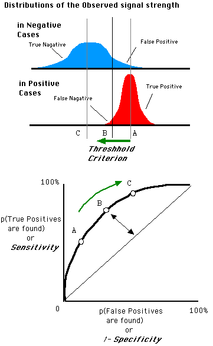
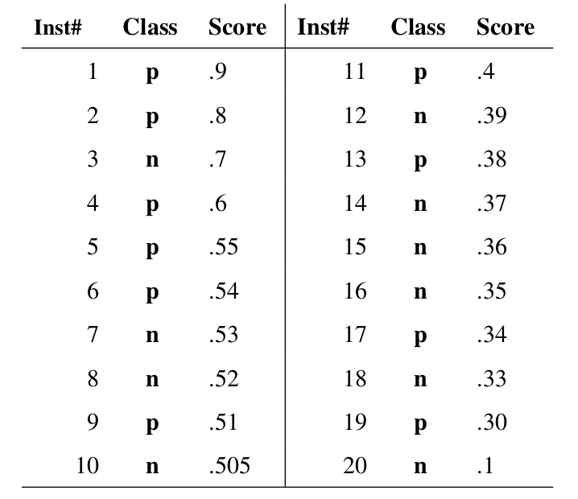
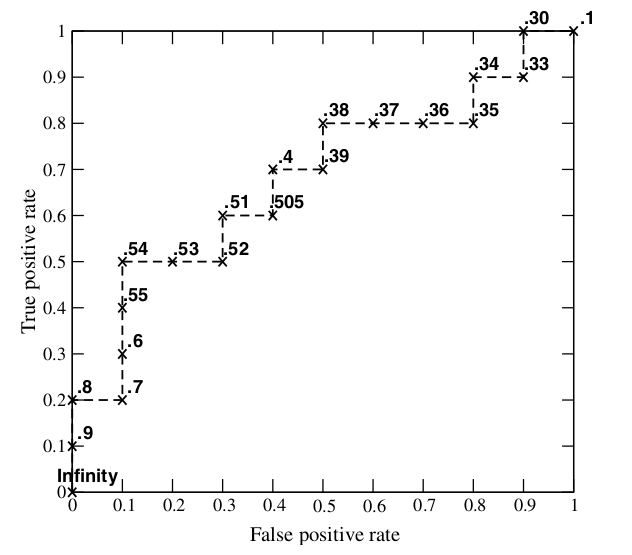
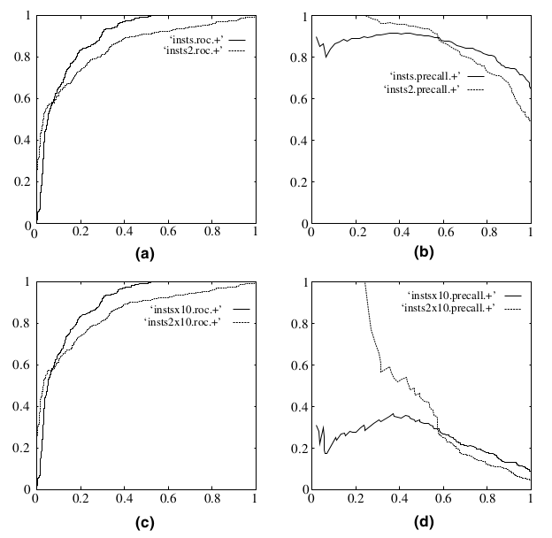

【阅读时间】16 - 26 min
【内容简介】系统详解分类器性能指标，什么是`准确率 - Accuracy`、`精确率 - Precision`、`召回率 - Recall`、`F1值`、`ROC曲线`、`AUC曲线`、`误差 - Error`、`偏差 - Bias`、`方差 - Variance`及`Bias-Variance Tradeoff`

<!-- more -->

在任何领域，评估（Evaluation）都是一项很重要的工作。在Machine Learning领域，定义了许多概念并有很多手段进行评估工作

# 混淆矩阵 - Confusion Matrix

**准确率**定义：对于给定的测试数据集，分类器**正确分类的样本数**与**总样本数**的之比

通过准确率，的确可以在一些场合，从某种意义上得到一个分类器是否有效，但它并不总是能有效的评价一个分类器的工作。一个例子，Google抓取了100个特殊页面，它的索引中有10000000页面。随机抽取一个页面，这是不是特殊页面呢？如果我们的分类器确定一个分类规则：“只要来一个页面就判断为【不是特殊页面】”，这么做的效率非常高，如果计算按照准确率的定义来计算的话，是(9,999,900/10,000,000) = 99.999%。虽然高，但是这不是我们并不是我们真正需要的值，就需要新的定义标准了

对于一个二分类问题来说，将实例分为**正类（Positive/+）**或**负类（Negative/-）**，但在使用分类器进行分类时会有四种情况

- 一个实例是正类，并被预测为正类，记为真正类（True Positive **TP/T+**）
- 一个实例是正类，但被预测为负类，记为假负类（False Negative **FN/F-**）
- 一个实例是负类，但被预测为正类，记为假正类（False Positive **FP/F+**）
- 一个实例是负类，但被预测为负类，记为真负类（True Negative **TN/F-**）

**TP和TN中的真表示分类正确，同理FN和FP表示分类错误的**

为了全面的表达所有二分问题中的指标参数，下列矩阵叫做**混淆矩阵 - Confusion Matrix**，目的就是看懂它，搞清楚它，所有模型评价参数就很清晰了


<?xml version="1.0" standalone="no"?>
<svg xmlns="http://www.w3.org/2000/svg" xmlns:xlink="http://www.w3.org/1999/xlink" width="100%" height="100%" viewBox="0 5.5 96 48">
 <title>DiagnosticTesting Diagram</title>
 <desc>Relationships between various measures of diagnostic testing by CMG Lee. In the SVG image, hover over a block or relation to highlight it.</desc>
 
 <defs>
  <rect id="box" x="-6" y="-1.3" width="12" height="2.6" stroke-width="2.8" stroke-opacity="1"/>
  <g id="top"    ><path d="M  0, 0 q  0,-4  5,-4 h  30 q  5, 0   5, 4 m -20,  0 q  0,-4 -5,-4" stroke-dasharray="0.1,1"/><text class="op" x="8"    y="-3"  dy="0.7ex">+</text></g>
  <g id="bottom1"><path d="M  0, 0 q  0, 4 -5, 4 h -50 q -5, 0  -5,-4 m  20,  0 q  0, 4  5, 4" stroke-dasharray="2,1"  /><text class="op" x="0"    y="4"   dy="0.7ex">&#247;</text></g>
  <g id="bottom2"><path d="M  0, 0 q  0, 5 -5, 5 h -69 q -5, 0  -5,-5 m  40,  0 q  0, 5  5, 5"                         /><text class="op" x="0"    y="4.5" dy="0.7ex">&#247;</text></g>
  <g id="bottom3"><path d="M  0, 0 q  0, 4 -5, 4 h -30 q -5, 0  -5,-4 m  20,  0 q  0, 4  5, 4"                         /><text class="op" x="0"    y="4"   dy="0.7ex">&#247;</text></g>
  <g id="left"   ><path d="M  0, 0 q -9, 0 -9, 5 v  10 q  0, 5   9, 5 m   0,-10 q -9, 0 -9,-5" stroke-dasharray="0.1,1"/><text class="op" x="-8.5" y="1"   dy="0.7ex">+</text></g>
  <g id="right1" ><path d="M  0, 0 q  9, 0  9,-5 v -20 q  0,-5  -9,-5 m   0, 10 q  9, 0  9, 5" stroke-dasharray="2,1"  /><text class="op" x="8.5"  y="-1"  dy="0.7ex">&#247;</text></g>
  <g id="right2" ><path d="M  0, 0 q 10, 0 10,-5 v -30 q  0,-5 -10,-5 m   0, 20 q 10, 0 10, 5"                         /><text class="op" x="8.5"  y="0"   dy="0.7ex">&#247;</text></g>
  <g id="acc"    ><path d="M  0, 0 q  0, 5 -5, 5 h -69 q -5, 0  -5,-5 m  22, 10 q  0,-5  5,-5
                           M  0, 0 q  0, 5 -5, 5 h -17 q -5, 0  -5, 5 v       5 q  0, 1 -1, 1 h -5 q -4,0 -4,4"        /><text class="op" x="2.5"  y="4.5" dy="0.7ex">+,&#247;</text></g>
  <g id="dor"    ><path d="M  0, 0 q  0, 4 -5, 4 h  -5 q -5, 0  -5,-4 m   0,  8 q  0,-4  5,-4" stroke-dasharray="4,1"  /><text class="op" x="0"    y="4"   dy="0.7ex">&#247;</text></g>
  <g id="f1"     ><path d="M  0, 0 q -10,0 -9,-4 v -22 q  0,-2  -2,-2
                           M -9,-3 q -1,-1 -2,-1 h -43 q -5, 0  -5,-5"                         stroke-dasharray="0.1,1"/></g>
 </defs>
 <circle cx="0" cy="0" r="99999" fill="#999999"/>
 <g id="mainsvg">
  <g class="active" transform="translate(88,48)" stroke="#ddffdd"><use xlink:href="#f1"/><use xlink:href="#box"/><text class="label" x="0" y="0.5ex">F1 s.</text><title>F1 score = 2 / (1 / Recall + 1 / Precision)</title></g>
  <g class="active" transform="translate(88,10)" stroke="#cceecc"><use xlink:href="#acc"/><use xlink:href="#box"/><text class="label" x="0" y="0.5ex">ACC</text><title>Accuracy = (&#931; True positive + &#931; True negative) / &#931; Total population</title></g>
  <g class="active" transform="translate(88,39)" stroke="#dddddd"><use xlink:href="#dor"/><use xlink:href="#box"/><text class="label" x="0" y="0.5ex">DOR</text><title>Diagnostic odds ratio = Positive likelihood ratio / Negative likelihood ratio</title></g>
  <g class="active" transform="translate(70,39)" stroke="#eeeeee"><use xlink:href="#bottom3"/><use xlink:href="#box"/><text class="label" x="0" y="0.5ex">LR+</text><title>Positive likelihood ratio = True positive rate / False positive rate</title></g>
  <g class="active" transform="translate(70,48)" stroke="#cccccc"><use xlink:href="#bottom3"/><use xlink:href="#box"/><text class="label" x="0" y="0.5ex">LR&#8722;</text><title>Negative likelihood ratio = False negative rate / True negative rate</title></g>
  <g class="active" transform="translate(88,20)" stroke="#cceeff"><use xlink:href="#bottom2"/><use xlink:href="#box"/><text class="label" x="0" y="0.5ex">FDR</text><title>False discovery rate = &#931; False positive / &#931; Predicted condition positive</title></g>
  <g class="active" transform="translate(70,20)" stroke="#ccffee"><use xlink:href="#bottom1"/><use xlink:href="#box"/><text class="label" x="0" y="0.5ex">PPV</text><title>Positive predictive value, Precision = &#931; True positive / &#931; Predicted condition positive</title></g>
  <g class="active" transform="translate(88,30)" stroke="#aaddcc"><use xlink:href="#bottom2"/><use xlink:href="#box"/><text class="label" x="0" y="0.5ex">NPV</text><title>Negative predictive value = &#931; True negative / &#931; Predicted condition negative</title></g>
  <g class="active" transform="translate(70,30)" stroke="#eeddee"><use xlink:href="#bottom1"/><use xlink:href="#box"/><text class="label" x="0" y="0.5ex">FOR</text><title>False omission rate = &#931; False negative / &#931; Predicted condition negative</title></g>
  <g class="active" transform="translate(30,39)" stroke="#eeffcc"><use xlink:href="#right1"/><use xlink:href="#box"/><text class="label" x="0" y="0.5ex">TPR</text><title>True positive rate, Recall, Sensitivity, probability of detection = &#931; True positive / &#931; Condition positive</title></g>
  <g class="active" transform="translate(30,48)" stroke="#ffeecc"><use xlink:href="#right2"/><use xlink:href="#box"/><text class="label" x="0" y="0.5ex">FNR</text><title>False negative rate, Miss rate = &#931; False negative / &#931; Condition positive</title></g>
  <g class="active" transform="translate(50,39)" stroke="#eeddbb"><use xlink:href="#right1"/><use xlink:href="#box"/><text class="label" x="0" y="0.5ex">FPR</text><title>False positive rate, Fall-out, probability of false alarm = &#931; False positive / &#931; Condition negative</title></g>
  <g class="active" transform="translate(50,48)" stroke="#ddeebb"><use xlink:href="#right2"/><use xlink:href="#box"/><text class="label" x="0" y="0.5ex">TNR</text><title>True negative rate, Specificity = &#931; True negative / &#931; Condition negative</title></g>
  <g class="active" transform="translate(70,10)" stroke="#eeeecc"><use xlink:href="#bottom1"/><use xlink:href="#box"/><text class="label" x="0" y="0.5ex">prev.</text><title>Prevalence = &#931; Condition positive / &#931; Total population</title></g>
  <g class="active" transform="translate(10,10)" stroke="#dddddd"><use xlink:href="#top"/><use xlink:href="#left"/><use xlink:href="#box"/><text class="label" x="0" y="0.4ex">pop.</text><title>Total population = Condition positive + Condition negative
 = Predicted condition positive + Predicted condition negative
 样本空间 = 正类 + 负类 = 预测结果正类 + 预测结果负类</title></g>

  <g class="active" transform="translate(10,30)" stroke="#aadddd"><use xlink:href="#top"/><use xlink:href="#box"/><text class="label" x="0" y="0.5ex">Pc&#8722;</text><title>Predicted condition negative = False negative + True negative</title></g>
  <g class="active" transform="translate(10,20)" stroke="#ccffff"><use xlink:href="#top"/><use xlink:href="#box"/><text class="label" x="0" y="0.5ex">Pc+</text><title>Predicted condition positive = True positive + False positive</title></g>
  <g class="active" transform="translate(30,10)" stroke="#ffffcc"><use xlink:href="#left"/><use xlink:href="#box"/><text class="label" x="0" y="0.5ex">C+</text><title>Condition positive = True positive + False negative</title></g>
  <g class="active" transform="translate(50,10)" stroke="#ddddaa"><use xlink:href="#left"/><use xlink:href="#box"/><text class="label" x="0" y="0.5ex">C&#8722;</text><title>Condition negative = False positive + True negative</title></g>
  <g class="active" transform="translate(50,30)" stroke="#bbeebb"><use xlink:href="#box"/><text class="label" x="0" y="0.5ex">T&#8722;</text><title>负类中预测正确的部分</title></g>
  <g class="active" transform="translate(30,30)" stroke="#ffdddd"><use xlink:href="#box"/><text class="label" x="0" y="0.5ex">F&#8722;</text><title>负类中预测错误的部分</title></g>
  <g class="active" transform="translate(50,20)" stroke="#eedddd"><use xlink:href="#box"/><text class="label" x="0" y="0.5ex">F+</text><title>正类中预测错误的部分</title></g>
  <g class="active" transform="translate(30,20)" stroke="#ccffcc"><use xlink:href="#box"/><text class="label" x="0" y="0.5ex">T+</text><title>正类中预测正确的部分</title></g>
 </g>
</svg>



通过上面的的讨论已经有`T+:TP` `F+:FP` `T-:TN` `F-:FN` `C+:样本正类` `C-:样本负类` `Pc+:预测正类` `Pc-:预测负类` 

用样本中的正类和负类进行计算的定义

|  缩写  |         全称          |               等价称呼               |            计算公式             |
| :--: | :-----------------: | :------------------------------: | :-------------------------: |
| TPR  | True Positive Rate  |   真正类率 `Recall` `Sensitivity`    | $ \frac {\sum T+}{\sum C+}$ |
| FNR  | False Negative Rate | 假负类率`Miss rate` `Type rs  error` | $ \frac {\sum F-}{\sum C+}$ |
| FPR  | False Positive Rate |  假正类率`fall-out` `Type 1 error`   | $ \frac {\sum F+}{\sum C-}$ |
| TNR  |  Tre Negative Rate  |        真负类率`Specificity`         | $ \frac {\sum T-}{\sum C-}$ |

用预测结果的正类和负类进行计算的定义

|  缩写  |            全称             |       等价称呼       |             计算公式             |
| :--: | :-----------------------: | :--------------: | :--------------------------: |
| PPV  | Positive Predictive Value | 正类预测率`Precision` | $ \frac {\sum T+}{\sum Pc+}$ |
| FOR  |    False Omission Rata    |       假错误率       | $ \frac {\sum F-}{\sum Pc-}$ |
| FDR  |   False Discovery Rate    |       假发现率       | $ \frac {\sum F+}{\sum Pc+}$ |
| NPV  | Negative Predictive Value |      负类预测率       | $ \frac {\sum T-}{\sum Pc-}$ |

其他定义概念

|    缩写    |                全称                |   等价称呼   |                   计算公式                   |
| :------: | :------------------------------: | :------: | :--------------------------------------: |
|   ACC    |             Accuracy             |   准确率    |  $ \frac {\sum (T+) + \sum {T-}}{样本空间}$  |
|   LR+    |    Positive Likelihood Ratio     |  正类似然比   |           $ \frac {TPR}{FPR}$            |
|   LR-    |    Negative likelihood ratio     |  负类似然比   |           $ \frac {FNR}{TNR}$            |
|   DOR    |      Diagnostic odds ratio       |  诊断胜算比   |           $ \frac {LR+}{LR-}$            |
| F1 score |        $F_1$ test measure        |   F1值    | $\frac{2}{\frac{1}{recall}+\frac{1}{precision}}$ |
|   MCC    | Matthews Correlation coefficient | 马修斯相关性系数 | $\frac{TP \times TN - FP \times FN}{\sqrt {(TP + FP)(TP + FN)(TN + FP)(TN +FN)}}$ |

`LR+/-`指的是似然比，**LR+ 越大表示模型对正类的分类越好，LR-越大表示模型对负类的分类效果越好**

`F1值`是精确值和召回率的调和均值，其实原公式是 $F\_\beta = (1 + \beta^2)\frac{precision \times recall}{(\beta^2recall)+recall}$，这里的β表示：**召回率的权重是准确率的β倍**。即F值是一种精确率和召回率的综合指标，权重由β决定

`MCC`值在[-1,1]之间，靠近1表示完全预测正确，靠近-1表示完全悖论，0表示随机预测

最终为了不那么麻烦，说人话，还是**一图胜千言**

图片详解：

> 左边暗一些部分的点都是**真正的正类**，右边亮一些部分的点都是**真正的负类**
>
> 中间的一个圆圈就是我们的**正类分类器**：注意，这个**圈是的预测结果都是正类**，也就是说在这个分类器看来，它选择的这些元素都是它所认为的**正类**，对应的，当然是圈以外的部分，也就是**预测结果是负类的部分**
>
> 底下的Precision和Recall示意图也相当的直观，看一下就能明白

# ROC Curve

ROC - Receiver Operating Characteristic Curve，接受者操作特征曲线，ROC曲线

这个曲线乍看下为啥名称那么奇怪呢，原来这个曲线最早是由二战中的电子工程师和雷达工程师发明的，用来侦测战场上的敌军飞机，舰艇等，是一种信号检测理论，还被应用到心理学领域做知觉检测。

## 什么是ROC曲线

ROC曲线和混淆矩阵息息相关，上一部分已经详细解释了相关内容，这里直接说明ROC曲线的横坐标和纵坐标分别是什么

横坐标：FPR假正类率，纵坐标：TPR真正类率

初看之下你不懂一个曲线表示的什么意思，那么看几个特征点或特殊曲线是一个非常好的方法。按照这种方法来分析ROC曲线：

- 第一个点：(0,1)，`FPR=0` `TPR=1` ，这意味着所有的正类全部分类正确，或者说**这是一个完美的分类器**，将所有的样本都分类正确了
- 第二个点：(1,0)， `FPR=1` `TPR=0` ，和第一个点比较，这是第一个点的完全反面，意味着是个**最糟糕的分类器**，将所有的样本都分类错误了（但其实可以直接取反，就是最好的模型，因为是二分类问题）
- 第三个点：(0,0)，`FPR=0` `TPR=0` 也就是原点，这个点表示的意思是，**分类器预测所有的样本都为负类**
- 第四个点：(1,1)，`FPR=1` `TPR=1`，和第三个点对应，表示**分类器预测所有的样本都为正类**
- 一条线：y=x。这**条对角线上的点**实际上就是一个**采用随机猜测策略的分类器的结果**

总结来说，ROC曲线的面积越大，模型的效果越好；ROC曲线光滑以为着Overfitting越少

还是一图胜千言

$TPR = \frac{TP}{TP+FN}$ $FPR = \frac{FP}{FP+TN}$ 蓝色图像是正类分类器的概率分布，红色图像负类分类器的概率分布，竖直的黑线是阈值（Threshold），**二分类分类器的输出就是一个取值在[0,1]间的值（概率）**，我们将黑线从0移动到1，就能得出一条曲线，这条线就是ROC曲线

如果问这个**分类器画成的图像为**何是一个类似帽子的形状，例子是最佳的说明方法，我们就来算一个ROC曲线看看，下图是20个测试样本的结果，“Class”一栏表示每个测试样本真正的标签（p表示正类，n表示负类），“Score”表示每个测试样本属于正样本的概率，Inst#是序号数

接下来，我们从高到低，**依次将“Score”值作为阈值threshold**，当测试样本属于正样本的概率大于或等于这个threshold时，我们认为它为正样本，否则为负样本。举例来说，对于图中的**第4个样本**，其“Score”值为0.6，那么样本1，2，3，4都被认为是正样本，因为它们的“Score”值都大于等于0.6，而其他样本则都认为是负样本。**每次选取一个不同的threshold，我们就可以得到一组FPR和TPR，即ROC曲线上的一点。**这样一来，我们一共得到了**20组FPR和TPR的值（和你的测试样本的数量有关）**，将它们画在ROC曲线的结果如下图：

当然我们也可以曲很多个阈值画曲线，不一定非要从测试样本的结果中取20个

## 为什么使用ROC曲线

ROC曲线有一个很好的特性：当测试集中的**正负样本的分布变化**的时候，ROC曲线能够保持不变。在实际的数据集中经常会出现**类不平衡（class imbalance）现象**，即**负样本比正样本多很多（或者相反）**，而且**测试数据中的正负样本的分布也可能随着时间变化**。下图是ROC曲线和Precision-Recall曲线的对比：

在上图中，**(a)和(c)为ROC曲线**，**(b)和(d)为Precision-Recall曲线**。

(a)和(b)展示的是**分类其在原始测试集（正负样本分布平衡）的结果**，(c)和(d)是将测试集中**负样本的数量增加到原来的10倍后**，分类器的结果。可以明显的看出，**ROC曲线基本保持原貌，而Precision-Recall曲线则变化较大**，记住这个结论即可

# PRC Curve

在上面提到了一个指标，PRC - Precision-Recall 曲线，画法和ROC很相似，但是使用值是Precision和Recall

# AUC Value 

AUC - Area Under Curve被定义为ROC曲线下的面积

AUC在[0.5,1]之间，这是因为ROC曲线一般都处于y=x这条直线的上方（否则这个做分类器的人连简单的取非都不会真可以去死了）

AUC值越大，证明这个模型越好

# Bias-Variance Tradeoff

三个名词，`Error误差` `Bisa偏差` `Variance方差`

## 三个名词表示了什么

再来一次，一图胜千言

- **准**：Bias 描述的是**根据样本**训练的模型的**输出预测结果的期望**与**样本真实结果**的差距，说人话，这个模型对样本拟合的好不好。想在Bias上表现好，降低Bias，就是复杂化模型，增加模型的参数，但这样容易过拟合（Overfitting）**Low Bias对应的就是点都在靶心附近，所以瞄的都是准的，但手不一定稳**
- **确**：Variance 描述的是**根据样本**训练的模型在**测试集上的表现（泛化能力） **，想在Variance上表现好，降低Variance，需要简化模型，减少模型的参数，这样做容易欠拟合，对应上图的High Bias，点偏离的中心。**Low Variance对应的是点打的都很集中，但不一定在靶心附近，手很稳，但是瞄的不准**

要准确表达这两个定义的含义必须要使用公式化的语言，不得不感叹，**在准确描述世界运行的规律这件事上，数学比文字要准确并且无歧义的多，文字（例子）直观啰嗦，数学（公式）准确简介**

我们假设有这样的一个函数，$y=f(x) + \epsilon$ ，其中噪声 $\epsilon$ 均值为0，**方差为 $\sigma^2$** 

我们的目的是去找到一个函数 $\hat {f}(x)$ **尽可能接近** $f(x)$ ，我们可以用**均方误差（MSE）或者交叉熵，或者DL散度**来表示这个接近程度，我们希望 $(y - \hat f(x) )^2$ 对样本空间内的所有样本和测试集中的所有样本都**最小**

机器学习核心就是用各种不同的算法去找这个 $\hat f$，希望最小，那就使用一个公式来表征这个值得大小，**即期望，也称Total Error（误差），在机器学习的训练中，这个值是评判模型好坏最重要：**
$$
E[(y - \hat f(x))^2] = Bias[\hat f(x)]^2 + Var[\hat f(x)] + \sigma^2
$$

其中 $Bias[\hat f(x)] = E[\hat f(x) - f(x)]$，且 $Var[\hat f(x)] = E[\hat f(x)^2] - E[\hat f(x)]^2$

`Bias-Variance Tradeoff`作为机器学习一个核心训练的观点或者说概念，**推导觉得还是十分重要**，整理如下

## 推导过程
为了公式简介，把 $f(x)$ 与 $\hat f(x)$ 简写为 $f$ 与 $\hat f$ ，记随机变量为 $X$，有
$$
Var[X] = E[X^2] - E[X]^2 \implies E[X^2] = Var[X] + E[X]^2
$$

因为 $f$ 是一个已经确定的函数，所以 $E[f] = f$ 成立 

根据 $y = f + \epsilon$ 和 $E[\epsilon] = 0$ 有
$$
E[y] = E[f + \epsilon] = E[f] = f
$$
噪声的方差 $ Var[\epsilon] = \sigma^2$

$$
Var[y] = E[(y-E[y])^2] = E[(y - f)^2] = E[(f + \epsilon - f)^2] = E[\epsilon^2] = Var[\epsilon] + E[\epsilon]^2 = \sigma^2
$$
由于 $\epsilon$ 和 $\hat f$ 互相独立
$$
\begin{align}
E[(y - \hat f)^2] & = E[y^2 + \hat f^2 - 2y\hat f] \\ 
& = E[y^2] + E[\hat f^2] - E[2y\hat f] \\
& = Var[y] + E[y]^2 + Var[\hat f] + E[\hat f]^2 - 2fE[\hat f] \\
& = Var[y] + Var[\hat f] + (f^2 - 2fE[\hat f] + E[\hat f]^2) \\
& = Var[y] + Var[\hat f] + (f - E[\hat f])^2 \\
& = \sigma^2 + Var[\hat f] + Bias[\hat f]^2
\end{align}
$$

# 总结

感觉在实际使用中，你不需要去自己写代码来画这些曲线，只要是框架是一定整合了这些值得结果，但是知其然知其所以然，越了解它是如何画的，越能**处理奇怪的特殊情况**

常见的处理方式是记下来所有指标的结果，即这些指标怎么变，表示了模型的那些方面好或者坏的结论，但是如果在特殊的问题出现了不在你看的结果中的情况可能还是会捉襟见肘，还是脚踏实地，能看见更大的世界！

