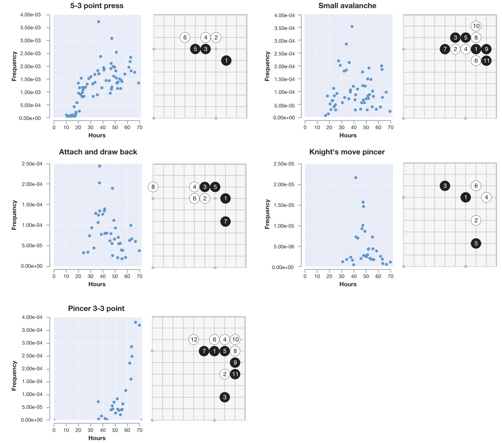
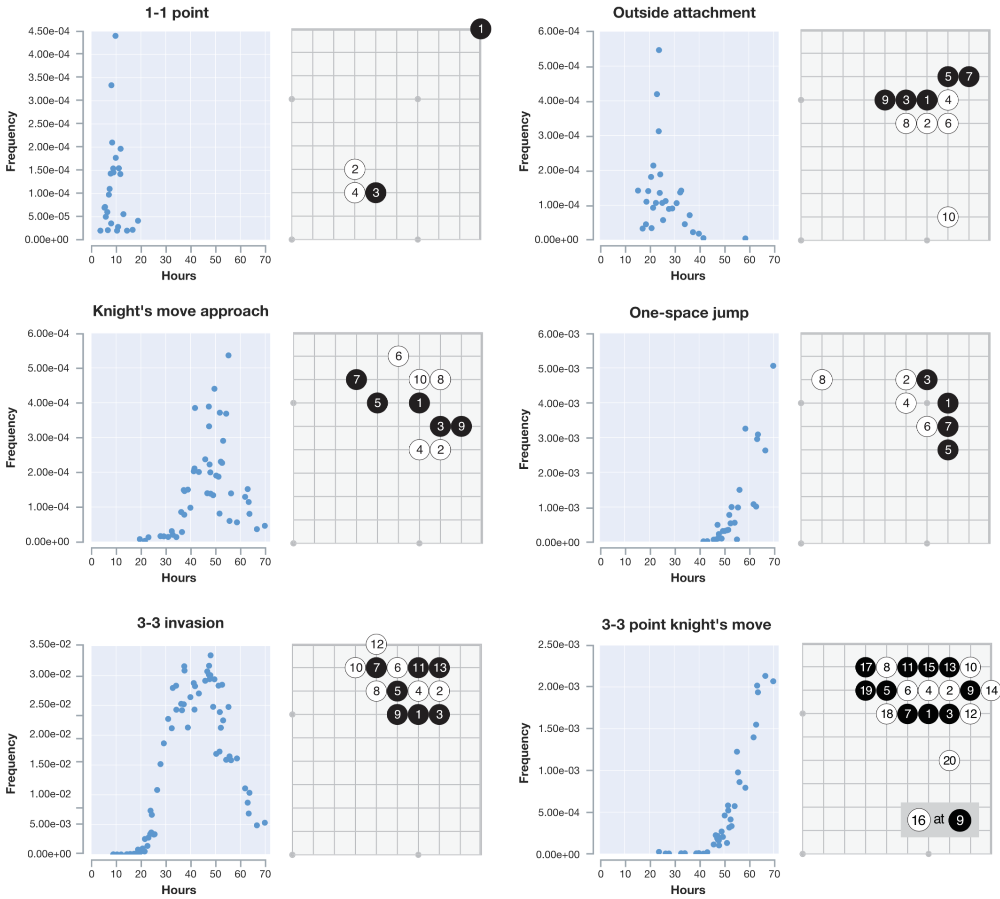

【阅读时间】15min - 17min
【内容简介】[AlphaGo1.0详解链接](https://charlesliuyx.github.io/2017/05/27/AlphaGo%E8%BF%90%E8%A1%8C%E5%8E%9F%E7%90%86%E8%A7%A3%E6%9E%90/)，这篇AlphaGo Zero论文原文超详细翻译，并且总结了AlphaGo Zero的算法核心思路，附带收集了网上的相关评论
<!-- more -->

在之前的详解：[深入浅出看懂AlphaGo](https://charlesliuyx.github.io/2017/05/27/AlphaGo%E8%BF%90%E8%A1%8C%E5%8E%9F%E7%90%86%E8%A7%A3%E6%9E%90/)中，详细定义的DeepMind团队定义围棋问题的结构，并且深入解读了AlphaGo1.0每下一步都发生了什么事，就在最近，AlphaGo Zero横空出世。个人观点是，如果你看了之前的文章，你就会觉得这是一个水到渠成的事情

# 论文正文内容详细解析

先上干货论文：[Mastering the Game of Go without Human Knowledge](https://deepmind.com/documents/119/agz_unformatted_nature.pdf) ，之后会主要**以翻译论文**为主，在语言上**尽量易懂，去除翻译腔**

AlphaGo Zero，从本质上来说完全不同于打败樊麾和李世石的版本

- 算法上，**自对弈强化学习，完全从随机落子开始**，不用人类棋谱。之前使用了大量棋谱学习人类的下棋风格）
- 数据结构上，只有**黑子白子两种状态**。之前包含这个点的气等相关棋盘信息
- 模型上，使用**一个**神经网络。之前使用了**策略网络（基于深度卷积神经网）**学习人类的下棋风格，**局面网络**（基于左右互搏生成的棋谱，为什么这里需要使用左右互搏是因为现有的数据集不够，没法判断落子胜率这一更难的问题）来计算在**当前局面下每一个不同落子的胜率**
- 策略上，基于训练好的这个神经网，进行简单的**树形搜索**。之前会使用蒙特卡洛算法实时演算并且**加权得出落子的位置**

## AlphaGo Zero 的强化学习

### 问题描述

在开始之前，必须再过一遍如何符号化的定义一个围棋问题

围棋问题，棋盘 `19×19=361` 个交叉点可供落子，每个点三种状态，白（用`1`表示），黑（用`-1`表示），无子（用`0`表示），用 $\vec s$ **描述**此时**棋盘的状态**，即棋盘的**状态向量**记为 $ \vec s$ （state首字母）
$$
\vec s = (\underbrace{1,0,-1,\ldots}_{\text{361}})
$$
假设状态 $\vec s$ 下，暂不考虑不能落子的情况， 那么下一步可走的位置空间也是361个。将下一步的**落子行动**也用一个361维的向量来表示，记为 $\vec a$ （action首字母）
$$
\vec a = (0,\ldots,0,1,0,\ldots)
$$
公式1.2 假设其中`1`在向量中位置为`39`，则  $\vec a$ 表示在棋盘`3行1列`位置落**白子**，黑白交替进行

有以上定义，我们就把围棋问题转化为。

> 任意给定一个状态  $\vec s$ ，寻找最优的应对策略  $\vec a$ ，最终可以获得棋盘上的最大地盘

简而言之

> 看到 $\vec s$ ，脑海中就是**一个棋盘，上面有很多黑白子**
>
> 看到 $\vec a$ ，脑海中就想象一个人**潇洒的落子**

### 网络结构

新的网络中，使用了一个参数为 $\theta$ （需要通过训练来不断调整） 的**深度神经网络**$f\_\theta$ 

- 【**网络输入**】`19×19×17`0/1值：现在棋盘状态的 $\vec s$ 以及**7步历史落子记录**。最后一个位置记录黑白，0白1黑
- 【**网络输出**】两个输出：**落子概率（`362`个输出值）**和**一个评估值（[-1,1]之间）**记为  $f_{\theta}(\mathbf {\vec s}) = (\mathbf p,v)$ 
  - 【落子概率 $\mathbf p$】 向量表示下一步在每一个可能位置**落子的概率，又称先验概率** （加上不下的选择），即  $p_a = Pr(\vec a|\mathbf {\vec s})$  （公式表示在当前输入条件下在每个可能点落子的概率）
  - 【评估值 $v$】 表示现在准备下当前这步棋的选手**在局面 $\vec s$ 下的胜率**（我这里强调局面是因为网络的输入其实包含历史对战过程）
- 【**网络结构**】基于**Residual Network**（大名鼎鼎ImageNet冠军ResNet）的卷积网络，包含20或40个Residual Block（残差模块），加入**批量归一化**Batch normalisation与**非线性整流器**rectifier non-linearities模块

### 改进的强化学习算法

自对弈强化学习算法（[什么是强化学习](https://mubu.com/doc/WNKomuDNl)，非常建议先看看强化学习的一些基本思想和步骤，有利于理解下面策略、价值的概念，推荐[系列笔记](http://www.cnblogs.com/steven-yang/p/6481772.html)）

在每一个状态  $\vec s$ ，利用**深度神经网络 $f_\theta$ 预测作为参照**执行MCTS搜索（[蒙特卡洛搜索树算法](https://charlesliuyx.github.io/2017/05/27/AlphaGo%E8%BF%90%E8%A1%8C%E5%8E%9F%E7%90%86%E8%A7%A3%E6%9E%90/#MCTS-蒙特卡洛搜索树——走子演算（Rollout）)），**MCTS搜索的输出是每一个状态下在不同位置对应的概率 $\boldsymbol \pi$ （注意这里是一个向量，里面的值是MCTS搜索得出的概率值）**，一种策略，从人类的眼光来看，就是看到现在局面，选择下在每个不同的落子的点的概率。如下面公式的例子，下在$(1,3)$位置的概率是`0.92`，有很高概率选这个点作为**落子点**

$$
\boldsymbol \pi_i = (\underbrace{0.01,0.02,0.92,\ldots}_{\text{361}})
$$


MCTS搜索得出的**落子概率**比 $f_\theta$ 输出的**仅使用神经网络输出的落子概率  $\mathbf p$ **更强，因此，MCTS可以被视为一个强力的**策略改善（policy improvement）过程**

使用基于MCTS提升后的策略（policy）来进行落子，然后用自对弈最终对局的胜者 $z$ 作为价值（Value），作为一个强力的**策略评估（policy evaluation）过程**

并用上述的规则，完成一个**通用策略迭代**算法去更新神经网络的**参数** $\theta$ ，使得神经网络输出的**落子概率和评估值**，即  $f_{\theta}(\mathbf {\vec s}) = (\mathbf p,v)$  更加贴近**能把这盘棋局赢下的落子方式（使用不断提升的MCST搜索落子策略$\boldsymbol \pi$ 和自对弈的胜者 $z$ 作为调整依据）**。并且，在下轮迭代中使用**新的参数**来进行自对弈

在这里补充**强化学习**的**通用策略迭代**（Generalized Policy Iteration）方法

- 从策略 $\pi\_0$ 开始

- **策略评估（Policy Evaluation）**- 得到策略 $\pi\_0$ 的价值 $v\_{\pi\_0}$ （对于围棋问题，即这一步棋是好棋还是臭棋）

- **策略改善（Policy Improvement）**- 根据价值 $v\_{\pi\_0}$，优化策略为 $\pi\_{0+1}$ （即人类学习的过程，加强对棋局的判断能力，做出更好的判断）

- 迭代上面的步骤2和3，直到找到最优价值 $v\_\*$ ，可以得到最优策略 $\pi\_\*$ 

  

> 【 a图】表示自对弈过程 $s\_1,\ldots,s\_T$。在每一个位置 $s\_t$ ，使用最新的神经网络 $f\_\theta$ 执行一次MCTS搜索 $\alpha\_\theta$ 。根据搜索得出的概率 $a\_t ~ \pi\_i$ 进行落子。终局 $s\_T$ 时根据围棋规则计算胜者 $z$
> $\pi\_i$ 是每一步时执行MCTS搜索得出的结果（柱状图表示概率的高低）

> 【b图】表示更新神经网络参数过程。使用原始落子状态 $\vec s\_t$ 作为输入，得到此棋盘状态 $\vec s\_t$ 下**下一步所有可能落子位置的概率分布** $\mathbf p\_t$ 和**当前状态  $\vec s\_t$ 下选手的赢棋评估值** $v\_t$ 
>
> **以最大化 $\mathbf p\_t$ 与 $\pi\_t$ 相似度和最小化预测的胜者 $v\_t$ 和局终胜者 $z$ 的误差来更新神经网络参数 $\theta$ （详见公式1）** ，更新参数 $\theta$ ，下一轮迭代中使用新神经网络进行自我对弈

我们知道，最初的蒙特卡洛树搜索算法是**使用随机**来进行模拟，在AlphaGo1.0中[使用**局面函数**辅助**策略函数**作为落子的参考](https://charlesliuyx.github.io/2017/05/27/AlphaGo%E8%BF%90%E8%A1%8C%E5%8E%9F%E7%90%86%E8%A7%A3%E6%9E%90/#利用强化学习增强棋力)进行模拟。在**最新的模型中，蒙特卡洛搜索树使用神经网络 $f\_\theta$ 的输出来作为落子的参考**（详见下图Figure 2）

每一条边 $(\vec s,\vec a)$ （每个状态下的落子选择）保存的是三个值：先验概率 $P(\vec s,\vec a)$，访问次数 $N(\vec s,\vec a)$，行动价值 $Q(\vec s,\vec a)$。

每次**模拟**（模拟一盘棋，直到分出胜负）从根状态开始，每次落子最大化[上限置信区间](https://baike.baidu.com/item/UCT%E7%AE%97%E6%B3%95/19451060?fr=aladdin) $Q(\vec s,\vec a) + U(\vec s,\vec a)$ 其中 $U(\vec s,\vec a) \propto \frac{P(\vec s,\vec a)}{1 + N(\vec s,\vec a)}$ 直到遇到叶子节点 $s'$

叶子节点（终局）只会被产生一次用于产生**先验概率和评估值**，符号表示即 $f\_\theta(s') = (P(s',\cdot), V(s'))$ 

模拟过程中**遍历每条边** $(\vec s, \vec a)$ 时更新**记录的统计数据**。访问次数加一 $N(\vec s,\vec a) += 1$；更新行动价值为整个模拟过程的平均值，即  $Q(\vec s, \vec a) = \frac{1}{N(\vec s, \vec a) \Sigma_{\vec s'|\vec s, \vec a \implies \vec s'}V(\vec s')}$ ，$\vec a \implies \vec s'$ 表示在模拟过程中从 $\vec s$ 走到 $\vec s'$的所有落子行动 $\vec a$

> 【a图】表示模拟过程中遍历时选 $Q+U$ 更大的作为落子点
>
> 【b图】叶子节点 $s\_L$ 的扩展和评估。**使用神经网络对状态 $s\_L$ 进行评估**，即 $f\_\theta(s\_L) = (P(s\_L,\cdot), V(s\_L))$ ，**其中 $\mathbf P$ 的值存储在叶子节点扩展的边中**
>
> 【c图】更新**行动价值** $Q$ 等于此时根状态 $\vec s$ 所有子树评估值 $V$ 的平均值
>
> 【d图】当MCTS搜索完成后，**返回这个状态 $\vec s$ 下每一个位置的落子概率** $\boldsymbol \pi$，成比例于 $N^{1/\tau}$（$N$为访问次数，$\tau$ 为控温常数）
>
> 更加具体的详解见：[搜索算法](#搜索算法)

MCTS搜索可以看成一个自对弈过程中决定每一步如何下的依据，根据神经网络的参数 $\theta$ 和根的状态 $\vec s$ 去计算**每个状态下落子位置的先验概率**，记为 $\boldsymbol \pi  = \alpha\_\theta(\vec s)$ ，幂指数**正比于**访问次数 $\pi\_{\vec a} \propto N(\vec s, \vec a)^{1/\tau}$，$\tau$ 是温度常数

### 训练步骤总结

使用MCTS下每一步棋，进行自对弈，**强化学习算法（必须了解通用策略迭代的基本方法）的迭代过程中**训练神经网络

- 神经网络参数**随机初始化** $\theta\_0$
- 每**一轮迭代** $i \geqslant 1$ ，都**自对弈一盘**（见[Figure-1a](#Figure1)）
- 第 $t$ 步：MCTS搜索 $\boldsymbol \pi\_t = \alpha \theta\_{i-1}(s\_t)$ 使用**前一次迭代的神经网络** $f\_{\theta\_{i-1}}$，根据MCTS结构计算出的**落子策略 $\boldsymbol \pi\_t$ 的联合分布进行【采样】再落子**
- 在 $T$ 步 ：双方都选择跳过；搜索时评估值低于投降线；棋盘无地落子。根据胜负得到**奖励值**Reward $r_T \in \{-1,+1\}$。
- MCTS搜索下至中盘的过程的每一个第 $t$ 步的数据存储为  $\vec s_t,\mathbf \pi_t, z_t$  ，其中 $z\_t = \pm r\_T$ 表示在第 $t$ 步时的胜者
- 同时，从上一步 $\vec s$ 迭代时自对弈棋局过程中产生的数据 $(\vec s, \boldsymbol \pi, z)$ （**$\vec s$ 为训练数据，$\boldsymbol \pi, z$ 为标签**）中**采样**（这里的采样是指选Mini-Batch）来训练网络参数 $\theta\_i$，
- 神经网络 $f\_{\theta\_i}(\vec s) = (\mathbf p, v)$以**最大化 $\mathbf p\_t$ 与 $\pi\_t$ 相似度和最小化预测的胜者 $v\_t$ 和局终胜者 $z$ 的误差来更新神经网络参数 $\theta$ **，损失函数公式如下


$$
l = (z - v)^2 - \boldsymbol {\pi}^T \log(\mathbf p) + c \Vert \theta \Vert ^2 \tag 1
$$


> 其中 $c$ 是`L2`正则化的系数

## AlphaGo Zero训练过程中的经验

最开始，使用完全的随机落子**训练持续了大概3天**。训练过程中，产生490万场自对弈，每次MCTS大约1600次模拟，每一步使用的时间0.4秒。使用了2048个位置的70万个Mini-Batches来进行训练。

训练结果如下，图3

> 【a图】表示随时间AlphaGo Zero棋力的增长情况，**显示了每一个不同的棋手 $\alpha\_{\theta\_i}$ 在每一次强化学习迭代时的表现**，可以看到，它的增长曲线非常平滑，没有很明显的震荡，稳定性很好
>
> 【b图】表示的是**预测准确率**基于不同迭代第$i$轮的 $f\_{\theta\_i}$
>
> 【c图】表示的MSE（平方误差）

在24小时的学习后，无人工因素的强化学习方案就打败了通过模仿人类棋谱的监督学习方法

为了分别评估结构和算法对结构的影响，得到了，下图4

> dual-res 表示 AlphaGo Zero
> sep-conv表示 AlphaGo Lee（几百李世乭的）使用的网络结构（P+V且分开）

## AlphaGo Zero学到的知识

在训练过程中，AlphaGo Zero可以一步步的学习到一些**特殊的围棋技巧（定式）**，如图5

> 中间的黑色横轴表示的是学习时间
>
> 【a图】对应的5张棋谱展现的是不同阶段AlphaGo Zero在自对弈过过程中展现出来的**围棋定式**上的新发现
>
> 【b图】展示在右星位上的定式下法的进化。可以看到训练到50小时，**点三三出现了**，但再往后训练，b图中的**第五种定式**高频率出现，在AlphGa Zero看来，这一种形式似乎更加强大
>
> 【c图】展现了前80手自对弈的棋谱伴随时间，明显有很大的提升，在第三幅图中，已经展现出了比较明显的**围**的倾向性
>
> 具体频率图见：[出现频率随训练时间分布图](#Figure5)

## AlphaGo Zero的最终实力

之后，最终的AlphaGo Zero 使用40个残差模块，训练接近40天。在训练过程中，产生了2900万盘的自对弈棋谱，使用了310万个Mini-Batches来训练神经网络，每一个Mini-Batch包含了2048个不同的状态。（覆盖的状态数是63亿（$10^10$），但和围棋的解空间 $2^361 \approx 10^108$ 相比真的很小，也从侧面反映出，**围棋中大部分选择都是冗余的**。在一个棋盘局面下，根据**先验概率**，估计只有15-20种下法是**值得考虑**的）

被评测不同版本使用计算力的情况，AlphaGo Zero和AlphaGo Master被部署到有**4个TPUs**的单机上运行（主要用于做**模型的输出预测Inference和MCTS搜索**），AlphaGo Fan（打败樊麾版本）和AlphaGo Lee（打败李世乭版本） **分布式部署到机器群**里，总计有176GPUs和48GPUs（Goolge真有钱）。还加入了**raw network，它是每一步的仅仅使用训练好的深度学习神经网的输出 $\mathbf p\_a$ 为依据选择最大概率点来落子，不使用MCTS搜索**（Raw Network裸用深度神经网络的输出已经十分强大，甚至已经接近了AlphaGo Fan）

下图6展示不同种AlphaGo版本的棋力情况

> 【a图】随着训练时间棋力的增强曲线
>
> 【b图】裸神经网络得分3055，AlphaGo Zero得分5185，AlphaGo Master得分4858，AlphaGo Lee得分3738，AlphaGo Fan得分3144
>

最终，AlphaGo Zero 与 AlphaGo Master的**对战比分为89：11**，对局中限制一场比赛在2小时之内（新闻中的零封是对下赢李世乭的AlphaGo Lee）

# 论文附录内容

我们知道，Nature上的文章一般都是很强的可读性和严谨性，每一篇文章的正文可能只有4-5页，但是附录一般会远长于正文。基本所有你的**技术细节疑惑**都可以在其中找到结果，这里值列举一些我自己比较感兴趣的点，如果你是专业人士，甚至想复现AlphaGo Zero，读原文更好更精确

## 自对弈训练工作流

AlphaGo Zero的工作流由三个模块构成，可以异步多线程进行：

- 深度神经网络**参数** $\theta\_i$ 根据自对弈数据**持续优化**
- 持续对棋手 $\alpha\_{\theta\_i}$ **棋力值**进行**评估**
- 使用表现最好的 $\alpha\_{\theta\_\*}$ 用来产生新的**自对弈数据**

### 优化参数

每一个神经网络 $f\_{\theta\_i}$ 在**64个GPU工作节点**和**19个CPU参数服务器**上进行优化。

**批次（batch）每个工作节点32个**，每一个**mini-batch大小为2048**。每一个 **mini-batch 的数据**从最近**50万盘**的自对弈棋谱的状态中联合随机采样。

**神经网络权重**更新使用带有**动量（momentum）和学习率退火（learning rate annealing）的随机梯度下降法（SGD）**，损失函数见公式1

学习率退火比率见下表

|  步数（千）  |   强化学习率   |   监督学习率   |
| :-----: | :-------: | :-------: |
|  0-200  | $10^{-2}$ | $10^{-1}$ |
| 200-400 | $10^{-2}$ | $10^{-2}$ |
| 400-600 | $10^{-3}$ | $10^{-3}$ |
| 600-700 | $10^{-4}$ | $10^{-4}$ |
| 700-800 | $10^{-4}$ | $10^{-5}$ |
|  >800   | $10^{-4}$ |     -     |

动量参数设置为**0.9**

L2正则化系数设置为 $c = 10^{-4}$

**优化过程每1000个训练步数**执行一次，并使用这个**新模型**来生成下一个Batch的**自对弈棋谱**

### 评估器

在使用检查点（checkpoint）新的神经网络去生成自对弈棋谱前，使用**现有的最好网络**来对它进行评估

评估神经网络 $f\_{\theta\_i}$ 的方法是使用  $f\_{\theta\_i}$ 进行MCTS搜索得出 $\alpha\_{\theta\_i}$ 

每一个评估由**400盘对局**组成，MCTS搜索使用**1600次模拟**，将温度参数设为无穷小 $\tau \implies 0$（目的是为了使用**最多访问次数**的落子下法去下，追求最强的棋力），如果新的选手 $\alpha\_{\theta\_i}$ 胜率大于 55%，将这个选手更新为最佳选手 $\alpha\_{\theta\_\*}$ ，用来产生下一轮的自对弈棋谱，并且设为下一轮的比较对象

### 自对弈

通过评估器，现在已经有一个**当前的最好棋手** $\alpha\_{\theta\_\*}$，使用它来产生数据。在每一次迭代中， $\alpha\_{\theta\_\*}$ 自对弈**25000盘**，其中每一步使用1600次MCTS模拟（每一步大约会花费0.4秒）

**前30步**，温度 $\tau = 1$，与MCTS搜索中的访问次数成正比，目的是保证**前30步下法的多样性**。在之后的棋局中，温度设为无穷小。并在**先验概率中加入狄利克雷噪声**  $P(\vec s, \vec a) = (1 - \epsilon) p_{\vec a} + \epsilon \eta_{\vec a}$ ，其中 $\eta \sim Dir(0.03)$ 且 $\epsilon = 0.25$。这个噪声保证所有的落子可能都会被尝试，但可能下出臭棋

**投降阈值** $v\_{rerign}$ 自动设为**错误正类率（如果AlphaGo没有投降可以赢的比例）**小于5%，为了测量错误正类(false positives)，在10%的自对弈中关闭投降机制，必须下完

## 搜索算法

这一部分详解的AlphaGo Zero的算法核心示意图[Figure2](#Figure2)

每一个搜索树的中的节点 $\vec s$ 包含一条边 $(\vec s,\vec a)$ 对应所有可能的落子 $\vec a \in \mathcal A(\vec s)$ ，每一条边存储一个数据集
$$
\{N(\vec s,\vec a), W(\vec s,\vec a), Q(\vec s,\vec a), P(\vec s,\vec a)\}
$$

> $N(\vec s,\vec a)$ 表示**MCST的访问次数** 
> $W(\vec s,\vec a)$ 表示**行动价值的总和**
> $Q(\vec s,\vec a)$ 表示**行动价值的均值**
> $P(\vec s,\vec a)$ 表示选择这条边的**先验概率**

多线程执行多次模拟，每一次迭代过程先重复执行1600次Figure 2中的前3个步骤，计算出一个 $\boldsymbol \pi$ ，根据这个向量下现在的这一步棋

### Selcet - Figure2a

MCTS中的**选择步骤**和之前的版本相似，详见[AlphaGo之前的详解文章](https://charlesliuyx.github.io/2017/05/27/AlphaGo%E8%BF%90%E8%A1%8C%E5%8E%9F%E7%90%86%E8%A7%A3%E6%9E%90/#AlphaGo)，这篇博文**详细通俗**的解读了这个过程。概括来说，假设`L`步走到叶子节点，当走第 $t$ 步时，根据**搜索树的统计概率落子**

$$
\vec a_t = \operatorname*{argmax}_{\vec a}(Q(\vec s_t, \vec a) + U (\vec s_t, \vec a))
$$


其中计算 $U (\vec s\_t, \vec a)$ 使用PUCT算法的变体


$$
U(\vec s, \vec a) = c_{puct}P(\vec s, \vec a) \frac{\sqrt{\Sigma_{\vec b} N(\vec s, \vec b)}}{1 + N(\vec s, \vec a)}
$$


其中 $c\_{puct}$ 是一个常数。这种搜索策略落子选择**最开始**更趋向于**高先验概率**和**低访问次数**的，但逐渐的会更加趋向于选择有着**更高行动价值**的落子

### Expand and evaluate - Figure 2b

将叶子节点 $\vec s\_L$ 加到一个队列中等待输入至神经网络进行评估， $f_\theta(d_i(\vec s_L)) = (d_i(p), v)$ ，其中 $d\_i$ 表示一个**1至8的随机数**来表示双面反射和旋转选择（从8个不同的方向进行评估，）

队列中的不同位置组成一个大小为8的mini-batch输入到神经网络中进行评估。整个MCTS搜索线程被锁死直到评估过程完成。叶子节点被展开，每一条边 $(\vec s\_L,\vec a)$被初始化为  $\{N(\vec s_L,\vec a) = 0, W(\vec s_L,\vec a) = 0, Q(\vec s_L,\vec a) = 0, P(\vec s_L,\vec a) = p_a\}$ 。之后将神经网络的输出值 $v$ 传回

### Backup - Figure 2c

沿着**回溯的路线**将边的统计数据更新。


$$
N(\vec s_t, \vec a_t) = N(\vec s_t, \vec a_t)  + 1 \\
W(\vec s_t, \vec a_t)  = W(\vec s_t, \vec a_t)  + v \\
Q(\vec s_t, \vec a_t)  = \frac{W(\vec s_t, \vec a_t) }{N(\vec s_t, \vec a_t) }
$$


> 注解：在 $W(\vec s\_t, \vec a\_t)$ 的更新中，使用了神经网络的输出 $v$，而最后的价值就是策略评估中的

使用虚拟损失（virtual loss）确保每一个线程评估不同的节点

### Play - Figure 2d

进行了一次MCTS搜索后，AlphaGo Zero才从 $\vec s\_0$ 状态下走出第一步 $\vec s\_0$，与访问次数成幂指数比例


$$
\boldsymbol \pi(\vec a|\vec s_0) = \frac {N(\vec s_0,a)^{1/\tau}}{\Sigma_{\vec b} N(\vec s_0, \vec b)^{1/\tau}}
$$


其中 $\tau$ 是一个温度常数用来控制探索等级（level of exploration）。搜索树会在接下来的走子中继续使用，如果孩子节点和落子的位置吻合，它就成为新的根节点，保留子树的所有统计数据，同时丢弃其他的树。**如果根的评价值和它最好孩子的评价值都低于 $v\_{resign}$ AlphaGo Zero就认输**

与之前的版本的MCTS相比，**AlphaGo Zero最大的不同是没有使用走子网络（Rollout），而是使用一个神经网络**

## 数据集

[GoKifu数据集](http://gokifu.com/)，和[KGS数据集](https://u-go.net/gamerecords/)

## 图5更多细节

# 总结与随想

**AlphaGo Zero = 启发式搜索 + 强化学习 + 深度神经网络**，你中有我，我中有你，互相对抗，不断自我进化。使用**深度神经网络的训练作为策略改善**，**蒙特卡洛搜索树作为策略评价**的**强化学习算法**

之后提出一些我在看论文时带着的问题，最后给出我仔细看完每一行论文后得出的回答，如有错误，请批评指正！

## 问题与个人答案 

### 训练好的Alpha Zero在真实对弈时，在面对一个局面时**如何决定下在哪个位置**？

[评估器](#评估器)的落子过程即最终对弈时的落子过程（自对弈中的落子就是真实最终对局时的落子方式）：使用**神经网络的输出** $\mathbf p$ **作为先验概率**进行MCTS搜索，每步1600次（最后应用的版本可能和**每一步的给的时间**有关）模拟，前30步**采样落子**，剩下棋局使用最多访问次数来落子，得到 $\boldsymbol \pi$ ，然后选择落子策略中最大的一个位置落子

### AlphaGo Zero的**MCTS搜索算法**和和上个版本的**有些什么区别**？

[最原始MCTS解析](https://charlesliuyx.github.io/2017/05/27/AlphaGo%E8%BF%90%E8%A1%8C%E5%8E%9F%E7%90%86%E8%A7%A3%E6%9E%90/#MCTS-蒙特卡洛搜索树——走子演算（Rollout）)，[AlphaGo Lee加上策略函数和局面函数改进后的MCTS解析](https://charlesliuyx.github.io/2017/05/27/AlphaGo%E8%BF%90%E8%A1%8C%E5%8E%9F%E7%90%86%E8%A7%A3%E6%9E%90/#AlphaGo)

对于AlphaGo Zero来说

- 最大的区别在于，**模拟过程**中依据神经网络的输出 $\nathbf p$ 的概率分布**采样**落子。**采样是关键词**，如果模拟的盘数足够多，那这一步就会越来越强
- 其次，在[返回（Bakcup）部分](#Backup - Figure 2c)每一个点的价值（得分），使用了神经网络的输出 $v$。这个值也是**策略评估**的重要依据

### AlphaGo Zero 中的策略迭代法是如何工作的？

策略迭代法（Policy Iteration）是强化学习中的一种算法，简单来说：以某种**策略**（ $\pi_0$ ）开始，计算当前策略下的**价值函数**（ $v_{\pi_0}$ ）；然后**利用这个价值函数，找到更好的策略**（**E**valuate和**I**mprove）；接下来再用这个**更好的策略**继续前行，更新价值函数……这样经过若干轮的计算，如果一切顺利，我们的策略会收敛到**最优的策略**（ $\pi_*$ ），问题也就得到了解答。


$$
\pi_0 \xrightarrow{E} v_{\pi_0} \xrightarrow{I} \pi_1 \xrightarrow{E} v_{\pi_1} \xrightarrow{I} \pi_2 \xrightarrow{E} \cdots \xrightarrow{I} \pi_* \xrightarrow{E} v_*
$$


对于AlphaGo Zero来说，[详细可见论文](改进的强化学习算法)，简单总结如下

- 策略评估过程，即使用MCTS搜索**每一次模拟**的**对局胜者**，胜者的**所有落子**（$\vec s$）都获得**更好的评估值**
- 策略提升过程，即使用MCTS搜索返回的**更好策略** $\boldsymbol \pi$
- 迭代过程，即神经网络输出 $\mathbf p$ 和 $v$ 与策略评估和策略提升返回值的对抗（即神经网络的训练过程）

总的来说，有点像一个嵌套过程，MCST算法可以用来解决围棋问题，这个深度神经网络也可以用来解决围棋问题，而AlphaGo Zero将两者**融合**，你中有我，我中有你，不断对抗，不对自我进化

### AlphaGo Zero 最精彩的部分哪部分？


$$
l = (z - v)^2 - \boldsymbol {\pi}^T \log(\mathbf p) + c \Vert \theta \Vert ^2
$$


毫无悬念的，我会选择这个漂亮的公式，看懂公式**每一项的来历，即产生的过程**，就读懂了AlphaGo Zero，这是一个完美的对抗，完美的自我进化

第二我觉得很精彩的点子是将**深度神经网络作为一个模块**嵌入到了**强化学习的策略迭代法中**。最关键的是，**收敛速度快，效果好，解决各种复杂的局面**（比如一个关于围棋棋盘的观看角度可以从八个方向来看的细节处理的很好，又如神经网络的输入状态选择了使用**历史八步**）

## 随想和评论

[量子位汇集各家评论](https://zhuanlan.zhihu.com/p/30325845?group_id=905063580597968896)

- 不是**无监督学习**，带有明显胜负规则的强化学习是**强监督**的范畴
- 无需**担心快速的攻克其他领域**，核心还是**启发式搜索**
- **模型简约漂亮，充满整合哲学的优雅**，可怕的是效果和效率也同样极高
- AlphaGo项目在经历了**把书读厚**的过程后，已经取得了瞩目的成就依旧不满足现状，现通过AlphaGo Zero**把书读薄**，简约而不简单，大道至简，九九归一，已然位列仙班了

随着AlphaGo Zero的归隐，DeepMind已经正式转移精力到其他的任务上了。其他这个天才的团队还能搞出什么大新闻！

对于围棋这项运动的影响可能是：以后的学围棋手段会发生变化，毕竟世界上能复现AlphaGo Zero的绝对很多，那么AlphaGo Zero的实力那就是棋神的感觉，向AlphaGo Zero直接学习不是更加高效嘛？另，围棋受到的关注也应该涨了一波，是利好

感觉强化学习会越来越热，对于和环境交互这个领域，强化学习更加贴近于人类做决策的学习方式。个人预测，强化学习会在未来会有更多进展！AlphaGo Zero 可能仅仅是一个开头

以上！鞠躬！

